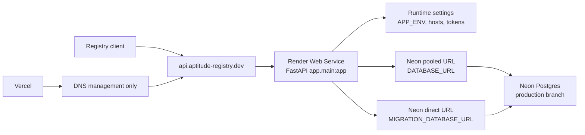

# Render and Neon Deployment Architecture

Canonical deployment document for the production Aptitude Registry API.

This document replaces the former deployment reference and deployment-readiness
changelog. It is current-state architecture first, with the deployment history
kept here only where it explains why the production shape looks this way.

## Deployment Shape



- Render owns the persistent FastAPI web service.
- Neon owns the production PostgreSQL database.
- Vercel may manage DNS for `aptitude-registry.dev`, but must not deploy a
  frontend, docs app, or Python Function for this project yet.
- Production API host: `https://api.aptitude-registry.dev`.
- Render fallback host: `https://aptitude-registry-api.onrender.com`.
- Root domain: leave unused, parked, or redirect later when a website exists.

Deployable backend entrypoint:

| Concern | Current value |
| --- | --- |
| FastAPI import string | `app.main:app` |
| FastAPI CLI entrypoint | `[tool.fastapi] entrypoint = "app.main:app"` in [`pyproject.toml`](../../pyproject.toml) |
| Runtime settings | [`app/core/settings.py`](../../app/core/settings.py) |
| Migration command | `uv run alembic upgrade head` |
| Liveness endpoint | `GET /healthz` |
| Readiness endpoint | `GET /readyz` |

## Current Live Deployment

Status verified from public endpoints on 2026-05-02.

| Resource | Value |
| --- | --- |
| Render service | `aptitude-registry-api` / `srv-d7pqsd7avr4c73bfb8t0` |
| Render primary URL | `https://aptitude-registry-api.onrender.com` |
| Production API URL | `https://api.aptitude-registry.dev` |
| Render region | `virginia`, matching the Neon `aws-us-east-1` project |
| Render branch tracking | Service metadata tracks `master`; target Blueprint state is `autoDeployTrigger: off` |
| Neon organization | `Aptitude` / `org-wild-pond-20247201`, managed directly in Neon Console |
| Neon project | `aptitude-registry` / `bitter-night-16887852` |
| Neon branch | `production` / `br-calm-bonus-ambx0ki5` |
| Neon database | `aptitude` |
| Neon role | `aptitude_app` |
| Neon PostgreSQL version | `17` |
| DNS status | `api.aptitude-registry.dev` resolves by CNAME to `aptitude-registry-api.onrender.com` |
| HTTPS status | `/healthz`, `/readyz`, and `/docs` return `200` on both the custom API domain and Render fallback host |

The registry database runs in a standalone Neon Console-managed organization.
The earlier Vercel-managed Neon project was deleted during cutover and is no
longer the production database source.

Trigger a Render deploy after changing production environment variables:

```bash
render deploys create srv-d7pqsd7avr4c73bfb8t0 --wait --confirm --output json
```

## Render Web Service

Create the production app as a Render Web Service from the Git repository using
the native Python runtime. Do not use Docker for the managed production
deployment unless this architecture is intentionally revisited.

Recommended settings:

| Setting | Value |
| --- | --- |
| Service name | `aptitude-registry-api` |
| Runtime | `Python 3` |
| Instance type | `Starter` for production so Render runs the pre-deploy migration hook |
| Branch | `master` |
| Region | Match Neon as closely as possible; current live service uses `virginia` for Neon `aws-us-east-1` |
| Python version env | `PYTHON_VERSION=3.12.13` |
| Build command | `uv sync --frozen --no-dev --extra otel` |
| Pre-deploy command | Target Blueprint state is disabled; production migration is owned by GitHub Actions before the deploy hook fires |
| Start command | `uv run fastapi run --entrypoint app.main:app --host 0.0.0.0 --port $PORT --no-proxy-headers` |
| Health check path | `/healthz` |

The `--extra otel` flag installs the OpenTelemetry SDK, OTLP/HTTP exporters,
and FastAPI/SQLAlchemy/psycopg/logging instrumentation packages used to ship
traces, logs, and metrics to Grafana Cloud. Without it the app boots in a
no-op telemetry mode, and `OTEL_ENABLED=true` fails at import time.

Required Render environment variables:

```text
APP_ENV=prod
APP_NAME=aptitude-registry
LOG_LEVEL=INFO
LOG_FORMAT=auto
DATABASE_URL=postgresql+psycopg://<neon-role>:<password>@<neon-pooler-host>/<database>?sslmode=require&channel_binding=require
MIGRATION_DATABASE_URL=postgresql+psycopg://<neon-role>:<password>@<direct-neon-host>/<database>?sslmode=require&channel_binding=require
AUTH_SERVICE_TOKENS_JSON=[{"token_id":"reader-token","secret_digest":"<sha256>","scopes":["read"],"active":true},{"token_id":"publisher-token","secret_digest":"<sha256>","scopes":["read","publish"],"active":true},{"token_id":"admin-token","secret_digest":"<sha256>","scopes":["read","publish","admin"],"active":true}]
ALLOWED_HOSTS_JSON=["api.aptitude-registry.dev","aptitude-registry-api.onrender.com"]
ACTIVE_POLICY_PROFILE=default
```

For production runtime, `DATABASE_URL` should use the Neon pooled host
(`-pooler`). `MIGRATION_DATABASE_URL` must use the direct Neon host because
Alembic should not run through PgBouncer.

Semantic discovery is off by default. When enabling it, keep the runtime mode
explicit:

```text
SEMANTIC_DISCOVERY_MODE=shadow
OPENAI_API_KEY=<encrypted OpenAI API key>
SEMANTIC_EMBEDDING_PROVIDER=openai
SEMANTIC_EMBEDDING_MODEL=text-embedding-3-small
SEMANTIC_EMBEDDING_INDEX_KEY=openai:text-embedding-3-small:description-tags-v1
SEMANTIC_EMBEDDING_DIMENSIONS=1536
SEMANTIC_CANDIDATE_LIMIT=20
SEMANTIC_QUERY_TIMEOUT_MS=150
SEMANTIC_HNSW_EF_SEARCH=100
```

Use `shadow` before `hybrid` so semantic retrieval can be observed without
changing discovery ordering. Do not enable `hybrid` until an embedding provider
and indexing job are actually writing `indexed` rows.

Keep the Render `onrender.com` host in `ALLOWED_HOSTS_JSON` until custom-domain
verification and health checks are stable. After that, either keep it for
emergency access or disable the Render subdomain and remove it from the
allowlist.

## Neon Database

Create one Neon production database in the standalone Neon Console-managed
organization:

| Neon resource | Value |
| --- | --- |
| Organization | `Aptitude` / `org-wild-pond-20247201` |
| Project | `aptitude-registry` / `bitter-night-16887852` |
| Branch | `production` / `br-calm-bonus-ambx0ki5` |
| Database | `aptitude` |
| Role | `aptitude_app` |

Use Neon's pooled connection string for runtime traffic and a direct connection
string for migration traffic. Convert both URL schemes to
`postgresql+psycopg://` because the app uses `psycopg[binary]`.

Do not point Alembic at a Neon pooled `-pooler` host. The app exposes this
split as `DATABASE_URL` for runtime and `MIGRATION_DATABASE_URL` for
migrations.

Semantic discovery uses Neon Postgres through `pgvector`, not a separate vector
database. Migration `0005_semantic_discovery_signals` enables the `vector`
extension and creates the `skill_search_embeddings` read model with a
`halfvec(1536)` column plus an HNSW cosine index. Migration
`0006_embedding_processing_status` adds `processing` as the worker claim state.
This means:

- the production database role used for migrations must be able to run
  `CREATE EXTENSION IF NOT EXISTS vector`;
- the migration must run over `MIGRATION_DATABASE_URL`, not the pooled runtime
  URL;
- runtime discovery may continue using the pooled `DATABASE_URL` because
  semantic queries use `SET LOCAL hnsw.ef_search` for the current transaction;
- HNSW tuning should start from the checked-in defaults and be changed through
  `SEMANTIC_HNSW_EF_SEARCH` only after measuring recall and latency on the
  production branch or a Neon branch.

Semantic index rows use the persisted index key
`openai:text-embedding-3-small:description-tags-v1`. OpenAI receives only the
provider model name `text-embedding-3-small`; the full index key is stored in
Postgres so older slug/name-based embeddings cannot mix with the current
description/tag-only source contract.

Manual/local indexing fallback:

```bash
APP_SETTINGS_ENV_FILE=/path/to/prod.env uv run python scripts/index_semantic_embeddings.py --batch-size 25 --max-batches 1 --reclaim-after-seconds 3600
```

Production indexing target:

Production indexing is repository-owned where Render Blueprint support permits
it. The desired target is a bounded Render Workflow task,
`aptitude-registry-semantic-indexing/index_semantic_embeddings`, triggered by a
Cron job that runs `scripts/trigger_semantic_embedding_workflow.py`.

Current Render limits matter: Workflows are beta, do not provide built-in
scheduling, and are not yet supported as a Blueprint service type. Keep the
Workflow service configured manually in Render with build command
`uv sync --frozen --no-dev --extra workflow` and start command
`uv run python workflows/semantic_embeddings.py`. The checked-in `render.yaml`
owns the Cron trigger and preserves the
`semantic-indexing-managed-outside-blueprint` marker as intentional drift
documentation, not a missing service definition.

Configure `DATABASE_URL`, `OPENAI_API_KEY`, `RENDER_API_KEY`, and the semantic
settings above for the indexing path. The local CLI remains the stable
fallback.

Enable the query-statistics extension once on the production database for
observability:

```sql
CREATE EXTENSION IF NOT EXISTS pg_stat_statements;
SELECT extname FROM pg_extension WHERE extname = 'pg_stat_statements';
```

## DNS and Domain Ownership

In Render:

1. Add `api.aptitude-registry.dev` as a custom domain on the web service.
2. Keep managed TLS enabled.
3. Copy Render's DNS target for the service.

In Vercel DNS for `aptitude-registry.dev`:

```text
Type: CNAME
Name: api
Value: aptitude-registry-api.onrender.com
TTL: auto/default
```

Do not configure a root-domain app deployment in Vercel. Vercel is DNS-only for
this project until a real website or docs app exists.

## OpenTelemetry Rollout

Optional OpenTelemetry to Grafana Cloud variables must be set together. See
[`../reference/observability-grafana-cloud.md`](../reference/observability-grafana-cloud.md)
for the Access Policy token scopes and signal-specific troubleshooting.

```text
OTEL_ENABLED=true
OTEL_EXPORTER_OTLP_PROTOCOL=http/protobuf
OTEL_EXPORTER_OTLP_ENDPOINT=https://otlp-gateway-<region>.grafana.net/otlp
OTEL_EXPORTER_OTLP_HEADERS=Authorization=Basic%20<base64(instance_id:access_token)>
OTEL_RESOURCE_ATTRIBUTES=service.namespace=aptitude,deployment.environment.name=prod
OTEL_TRACES_SAMPLER=parentbased_traceidratio
OTEL_TRACES_SAMPLER_ARG=0.1
```

Rollout sequence:

1. Provision a Grafana Cloud Access Policy with `metrics:write`, `logs:write`,
   and `traces:write` scopes.
2. Confirm the Grafana Cloud OTLP gateway URL for the stack region.
3. In Render, add the OTel variables and mark `OTEL_EXPORTER_OTLP_HEADERS`
   encrypted.
4. Keep the Build Command at `uv sync --frozen --no-dev --extra otel`.
5. Trigger a manual Render deploy.
6. Verify traces, logs, and metrics arrive in Grafana Cloud within about 60
   seconds of the first non-probe request.

When `OTEL_ENABLED=true` and `APP_ENV=prod`, the Settings validator refuses to
boot without `OTEL_EXPORTER_OTLP_ENDPOINT`.

## CI/CD Branch Lifecycle

CI/CD is split across four explicit GitHub Actions workflows so every branch
event has one deployment responsibility:

| Workflow | Trigger | Responsibility | Secrets |
| --- | --- | --- | --- |
| `.github/workflows/dev-pr-ci.yml` | Pull request to `dev` | Run `make _ci-quality` and `make _ci-test` only. | None beyond repository read access. |
| `.github/workflows/dev-push-ci.yml` | Push to `dev` | Build the app image, run Docker Compose smoke, and publish Docker Hub tags `dev` and `sha-*`. | `DOCKERHUB_USERNAME`, `DOCKERHUB_TOKEN`. |
| `.github/workflows/master-pr-ci.yml` | Pull request to `master` | Run the production-branch quality and test gate only. | None beyond repository read access. |
| `.github/workflows/master-push-ci.yml` | Push to `master` | Run the final quality/test gate, migrate Neon, verify Alembic head, create/update a GitHub `production` deployment, trigger Render for the pushed commit, then smoke production `/healthz` and `/readyz`. | `MIGRATION_DATABASE_URL`, `RENDER_DEPLOY_HOOK_URL`. |

This keeps credentials out of PR workflows and keeps promotion behavior on push
events only. Branch protection is not required by this document, but if it is
enabled later the required check names should come from these four workflows.

## Migration Policy

Production migration is owned by GitHub Actions, not the Render app startup
command.

On pushes to `master`, `.github/workflows/master-push-ci.yml` now runs the
final local gate and then, only after it passes:

1. Runs `uv run alembic upgrade head` against Neon.
2. Runs `uv run python scripts/check_alembic_at_head.py` to verify the live
   database revision equals the repository Alembic head.
3. Creates a GitHub Deployment for the pushed commit in the `production`
   environment and marks it `in_progress`.
4. Calls the Render deploy hook with the pushed commit SHA as the `ref` query
   parameter.
5. Waits for and verifies production `GET /healthz` and `GET /readyz` through
   `make _ci-production-smoke`.
6. Marks the GitHub Deployment `success` after production smoke, or `failure`
   if the Render trigger or production smoke fails.

This keeps schema mutation ahead of application promotion even while Render
pre-deploy commands are unavailable on the current plan. `render.yaml` sets
`autoDeployTrigger: off` so Render does not race the CI migration job.
The GitHub Deployment record is created after Alembic head verification, so
failed schema promotion does not create a misleading production deployment
attempt.

Live provider caveat verified on 2026-05-08: the Render service already has
`autoDeployTrigger: off` and PR previews disabled, but the service JSON still
reports a legacy `preDeployCommand` of `uv run alembic upgrade head`. The Render
CLI did not clear that field when passed an empty `--pre-deploy-command`. Until
the Dashboard or API clears it, treat that hook as a redundant safety net only;
GitHub Actions remains the authoritative migration and promotion gate.

Render documents deploy hooks as secret URLs that can be called from CI/CD
systems such as GitHub Actions. Render also documents `ref` on the deploy hook
as the way to deploy a specific commit SHA:

- [Render deploy hooks](https://render.com/docs/deploy-hooks)
- [Render deploying a specific commit](https://render.com/docs/deploying-a-commit)

Neon uses PgBouncer for pooled connection strings and recommends direct
connections for schema migrations. Runtime traffic should keep using the pooled
`DATABASE_URL`; migrations and Alembic-head checks must use the direct
`MIGRATION_DATABASE_URL`:

- [Neon connection pooling](https://neon.com/docs/connect/connection-pooling)

Required GitHub Actions secrets:

| Secret | Purpose |
| --- | --- |
| `DOCKERHUB_USERNAME` | Docker Hub username used only by the `dev` push Docker publish workflow. |
| `DOCKERHUB_TOKEN` | Docker Hub access token used only by the `dev` push Docker publish workflow. |
| `MIGRATION_DATABASE_URL` | Direct Neon connection string used only by Alembic and the head-verification script. It must not use a `-pooler` host. |
| `RENDER_DEPLOY_HOOK_URL` | Secret Render deploy hook URL for `aptitude-registry-api`. |

Optional GitHub Actions variable:

| Variable | Purpose |
| --- | --- |
| `PRODUCTION_BASE_URL` | Overrides the production smoke base URL when invoking `make _ci-production-smoke`; the Makefile defaults to `https://api.aptitude-registry.dev`. |

Runtime still uses the pooled Neon URL:

- `DATABASE_URL` remains pooled for the running app.
- `MIGRATION_DATABASE_URL` remains direct for Alembic.
- `alembic/env.py` rejects a selected Neon `-pooler` host before running
  migrations, including semantic-search migrations that create `pgvector`
  objects.
- If the service is later upgraded to a paid Render instance, the
  `preDeployCommand` can stay as a redundant safety net because
  `alembic upgrade head` is idempotent, but CI remains the deployment gate.

Emergency manual migration path:

```bash
APP_SETTINGS_ENV_FILE=/path/to/prod.env UV_CACHE_DIR=.uv-cache uv run alembic upgrade head
APP_SETTINGS_ENV_FILE=/path/to/prod.env UV_CACHE_DIR=.uv-cache uv run python scripts/check_alembic_at_head.py
```

## Deployment History

This section absorbs the former deployment-readiness changelog and standalone
Neon cutover note. Treat it as rationale for the current architecture, not as a
separate canonical history surface.

### Render and Neon Readiness

- Render plus Neon became the documented production deployment path for
  `https://api.aptitude-registry.dev`.
- Runtime and auth docs were updated so `APP_ENV=prod` host allowlisting points
  at the API subdomain and keeps the Render fallback host during rollout:
  [`.env.example`](../../.env.example),
  [`../reference/runtime-profiles.md`](../reference/runtime-profiles.md),
  [`../reference/service-token-governance.md`](../reference/service-token-governance.md).
- The tracked Vercel Python Function deployment surface was removed because
  Vercel is no longer the app host: `api/index.py`, `server.py`,
  `vercel.json`, and `.vercelignore` no longer define a deployment path.
- Direct runtime dependencies on deployment/tooling packages that are not
  needed by the Render-hosted app process were removed from
  [`pyproject.toml`](../../pyproject.toml) and [`uv.lock`](../../uv.lock).
- CORS stayed disabled because no browser client exists. The deployment work
  changed hosting and infrastructure guidance, not the public HTTP route
  contract in [`../reference/api-contract.md`](../reference/api-contract.md).

### Standalone Neon Cutover

- The first Neon organization was Vercel-managed and rejected creation of a
  separate `aptitude-registry` project.
- Production was cut over to a standalone Neon Console-managed organization,
  project, branch, database, and role.
- The cutover was schema-only; no data was copied from the deleted
  Vercel-managed Neon project.
- Alembic was run manually against the new direct Neon connection before the
  Render service environment was switched.
- Render deploy `dep-d7q5lqdckfvc739isqpg` verified the service after the
  database change.

## Plan 16 Trust-Consumer Deployment Readiness

[`Plan 16 - Registry Trust Consumer Contracts`](../../.agents/plans/16-registry-trust-consumer-contracts.md)
is planning-only in this repository state. There is no implemented Plan 16
deployment surface or milestone changelog to promote into current behavior.

The deployment architecture still needs to preserve these Plan 16 constraints:

| Consumer | Deployment implication |
| --- | --- |
| Gateway | Future trust-context reads must be served from the stable API host and remain exact-coordinate based, such as `slug@version`, instead of becoming fuzzy discovery or runtime orchestration. |
| Identity | Registry namespaces, scopes, policy visibility, and audit correlation must remain registry facts; principal lifecycle stays outside this service. |
| Token/spend control | Runtime usage attribution can reference registry artifact, organization, trust tier, promotion channel, and policy context, but budget enforcement and billing ledgers stay outside this service. |
| Audit consumers | Downstream events should be able to correlate back to registry publish, approval, promotion, policy, and audit evidence without mutating immutable artifact records. |

When Plan 16 is implemented, its changelog should document the new HTTP
contract, DTO shape, schema/storage changes, auth requirements, and deployment
verification against this Render/Neon production architecture. Until then, do
not describe gateway interception, identity issuance, token-budget enforcement,
or billing behavior as registry runtime features.

## Verification

Local preflight:

```bash
UV_CACHE_DIR=.uv-cache uv run --extra dev ruff check .
UV_CACHE_DIR=.uv-cache uv run --extra dev python -m mypy app
UV_CACHE_DIR=.uv-cache uv run --extra dev python -m pytest tests/unit -q
```

Render shell or deploy-log checks:

```bash
uv run alembic current
uv run alembic upgrade head
```

Endpoint checks:

```bash
curl -i https://aptitude-registry-api.onrender.com/healthz
curl -i https://aptitude-registry-api.onrender.com/readyz
curl -i https://aptitude-registry-api.onrender.com/docs
curl -i --max-time 20 https://api.aptitude-registry.dev/healthz
curl -i --max-time 20 https://api.aptitude-registry.dev/readyz
curl -i --max-time 20 https://api.aptitude-registry.dev/docs
```

DNS checks:

```bash
dig +short api.aptitude-registry.dev CNAME
dig +short api.aptitude-registry.dev A
```

Expected results:

- `/healthz` returns `200` with `"environment":"prod"`.
- `/readyz` returns `200` when Neon is reachable and `503` when the database is
  unavailable.
- `/docs` returns `200` in the current production app wiring.
- Protected routes without a valid token return `401` or `403`.
- `api.aptitude-registry.dev` resolves through `aptitude-registry-api.onrender.com`.

Telemetry verification after a deploy with `OTEL_ENABLED=true`:

- Traces: Grafana Cloud Tempo should show `service.name=aptitude-registry` and
  `deployment.environment.name=prod`; `/healthz` and `/readyz` should be
  excluded.
- Logs: Grafana Cloud Loki should receive application logs with `trace_id` and
  `span_id` fields on traced requests.
- Metrics: Grafana Cloud Mimir should show
  `aptitude_http_requests_total{deployment_environment_name="prod"}` increasing
  after one minute of traffic.

## Constraints

- Keep CORS disabled until a real browser client exists.
- Keep `/healthz` public and lightweight for Render health checks.
- Keep `/readyz` public as a dependency-readiness probe.
- Do not add Neon Auth, Neon JS SDK, Render SDKs, or PostgREST-style packages
  to the FastAPI app.
- Do not move gateway enforcement, identity lifecycle, token-budget
  enforcement, resolver reranking, dependency solving, or runtime execution into
  this repository.
