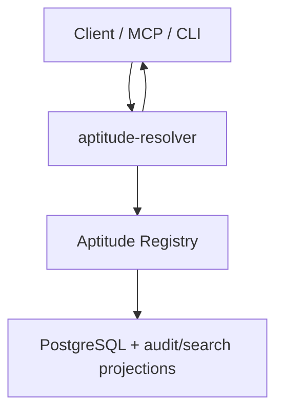

# Aptitude Registry System Overview

> Status: canonical high-level architecture for the current registry service.
> Use [`../reference/api-contract.md`](../reference/api-contract.md) for the live HTTP contract.

`Aptitude Registry` is the authoritative catalog for Aptitude skills. It is a package-registry-style backend that stores immutable skill versions, searchable metadata, direct authored dependency selectors, lifecycle state, provenance, and audit data.

## Core Law

- Registry owns data-local work.
- Resolver owns decision-local work.

Registry work includes publish, discovery candidate generation, exact dependency reads, exact metadata/content fetch, lifecycle governance, and audit.

Resolver work includes prompt interpretation, reranking, final selection, dependency solving, lock generation, and execution planning.

## Main Components

- `interface`: FastAPI routes, DTOs, auth/error mapping
- `core`: immutable publish/fetch/governance behavior and domain services
- `persistence`: SQLAlchemy adapters and storage projections
- `audit`: registry-side audit event recording
- `observability`: metrics, logging, request correlation

## Main Flows

### Publish

1. Publisher submits `slug`, `version`, content, metadata, governance, and relationships.
2. Registry validates immutability, schema, and policy.
3. Registry stores metadata, content, selectors, search projection, and audit events in PostgreSQL.

### Discovery

1. Resolver sends a structured search request.
2. Registry queries derived discovery documents, applies governance filters, and returns ordered candidate slugs only.
3. Resolver decides what to do with those candidates.

### Exact Reads

1. Resolver selects an exact `(slug, version)` coordinate.
2. Registry returns immutable metadata, immutable markdown, or direct authored `depends_on` selectors.
3. Resolver performs local solving, lock generation, and execution planning.

## Persistence Shape

- `skills`: stable slug identity and mutable aggregate install count
- `skill_versions`: immutable version binding plus lifecycle/trust/provenance
- `skill_metadata`: structured discovery and exact-metadata fields
- `skill_contents`: digest-deduplicated raw markdown
- `skill_relationship_selectors`: authored dependency and related selectors
- `skill_search_documents`: derived discovery read model
- `audit_events`: append-only audit sink

## What This Service Is Not

- It is not a resolver.
- It does not pick the “best” skill for a prompt.
- It does not compute canonical solved bundles.
- It does not own runtime plugin orchestration or execution plans.
