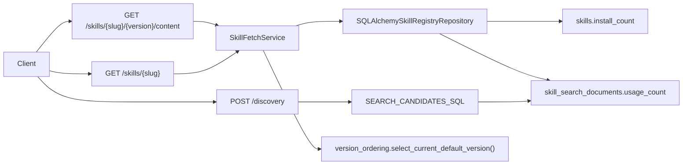
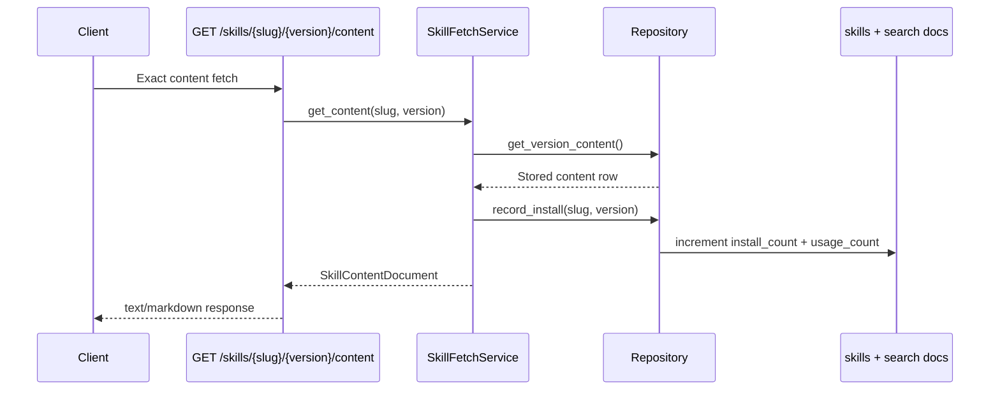

# Milestone 12 Changelog - Optional Evaluation Signals and Snapshotting

This changelog documents implementation of [.agents/plans/12-optional-evaluation-signals-and-snapshotting.md](../../.agents/plans/12-optional-evaluation-signals-and-snapshotting.md).

This milestone shipped as a deliberately constrained follow-up to the frozen registry contract. The branch adds one mutable install-derived signal on the skill identity, mirrors it into discovery ranking as a late tie-break, centralizes derived default-version selection, and explicitly leaves snapshot APIs plus broader semantic/co-usage retrieval work to follow-on planning in [.agents/plans/15-hybrid-semantic-and-co-usage-discovery.md](../../.agents/plans/15-hybrid-semantic-and-co-usage-discovery.md). Exact immutable coordinates remain the reproducibility baseline, and none of the new state lives in authored metadata, dependency declarations, or immutable version rows.

## Scope Delivered

- Exact metadata now carries a mutable aggregate `install_count` per skill slug, backed by the new `skills.install_count` column and surfaced through the existing exact metadata route rather than a new endpoint family: [alembic/versions/0002_skill_install_counts.py](../../alembic/versions/0002_skill_install_counts.py), [app/persistence/models/skill.py](../../app/persistence/models/skill.py), [app/core/skills/fetch.py](../../app/core/skills/fetch.py), [app/interface/api/fetch.py](../../app/interface/api/fetch.py), [app/interface/api/skill_api_support_fetch.py](../../app/interface/api/skill_api_support_fetch.py), [app/interface/dto/skills_fetch.py](../../app/interface/dto/skills_fetch.py), [docs/reference/api-contract.md](../reference/api-contract.md).
- Successful exact content fetches now update the derived evaluation signal in one repository method: `skills.install_count` increments once per successful read, and every `skill_search_documents` row for the same slug is rewritten to the same aggregate `usage_count` so discovery can reuse the signal without introducing a separate evaluation store or mutating immutable version rows, content rows, or authored selectors: [app/core/skills/fetch.py](../../app/core/skills/fetch.py), [app/persistence/skill_registry_repository_reads.py](../../app/persistence/skill_registry_repository_reads.py), [app/persistence/skill_registry_repository_support.py](../../app/persistence/skill_registry_repository_support.py), [tests/integration/test_skill_registry_endpoints.py](../../tests/integration/test_skill_registry_endpoints.py), [docs/reference/api-contract.md](../reference/api-contract.md), [docs/reference/schema.md](../reference/schema.md).
- Identity list responses and lifecycle updates now share one canonical ordering rule for `is_current_default` instead of relying on duplicated logic or a stored pointer. The rule remains derived from visible versions only and still does not introduce snapshot state or separate “latest view” APIs: [app/core/skills/version_ordering.py](../../app/core/skills/version_ordering.py), [app/core/skills/fetch.py](../../app/core/skills/fetch.py), [app/persistence/skill_registry_repository_base.py](../../app/persistence/skill_registry_repository_base.py), [app/persistence/skill_registry_repository_status.py](../../app/persistence/skill_registry_repository_status.py), [docs/reference/api-contract.md](../reference/api-contract.md), [tests/unit/test_skill_fetch_service.py](../../tests/unit/test_skill_fetch_service.py), [tests/integration/test_skill_registry_endpoints.py](../../tests/integration/test_skill_registry_endpoints.py).
- Snapshotting stayed deferred. The public route surface is still the same publish, discovery, resolution, exact metadata/content, lifecycle, and operability set from prior milestones, with no snapshot routes or pinned latest-state route tree added in this branch: [.agents/plans/12-optional-evaluation-signals-and-snapshotting.md](../../.agents/plans/12-optional-evaluation-signals-and-snapshotting.md), [docs/reference/api-contract.md](../reference/api-contract.md), [app/interface/api/discovery.py](../../app/interface/api/discovery.py), [app/interface/api/fetch.py](../../app/interface/api/fetch.py), [app/interface/api/resolution.py](../../app/interface/api/resolution.py).

## Architecture Snapshot

Why this shape:
- The evaluation signal stays derived and mutable on identity/search state instead of contaminating immutable version rows or authored metadata payloads, which matches the optional and advisory framing in Plan 12: [.agents/plans/12-optional-evaluation-signals-and-snapshotting.md](../../.agents/plans/12-optional-evaluation-signals-and-snapshotting.md), [app/persistence/models/skill.py](../../app/persistence/models/skill.py), [app/persistence/skill_registry_repository_reads.py](../../app/persistence/skill_registry_repository_reads.py).
- Default-version selection remains a pure derived rule shared by fetch and lifecycle paths, which avoids introducing a stored “latest snapshot” pointer or reopening route surface complexity: [app/core/skills/version_ordering.py](../../app/core/skills/version_ordering.py), [app/core/skills/fetch.py](../../app/core/skills/fetch.py), [app/persistence/skill_registry_repository_base.py](../../app/persistence/skill_registry_repository_base.py), [app/persistence/skill_registry_repository_status.py](../../app/persistence/skill_registry_repository_status.py).

## Runtime Flow

## Design Notes

- `install_count` is intentionally not part of authored immutable metadata. It is exposed alongside immutable metadata, but it lives on the logical skill identity and is updated after successful exact content reads, which keeps authored content, version digests, and dependency declarations unchanged: [app/core/skills/models.py](../../app/core/skills/models.py), [app/interface/dto/skills_fetch.py](../../app/interface/dto/skills_fetch.py), [app/core/skills/fetch.py](../../app/core/skills/fetch.py), [app/persistence/models/skill.py](../../app/persistence/models/skill.py).
- Discovery ranking reuses the same aggregate signal via `skill_search_documents.usage_count`, but only as a late tie-break after exact slug/name matches, lexical score, and tag overlap. That keeps discovery metadata-first and deterministic instead of letting mutable popularity dominate retrieval: [app/persistence/skill_registry_repository_support.py](../../app/persistence/skill_registry_repository_support.py), [app/persistence/models/skill_search_document.py](../../app/persistence/models/skill_search_document.py), [app/core/skills/search.py](../../app/core/skills/search.py).
- The branch deliberately does not add snapshot APIs, snapshot tables, or snapshot-aware fetch behavior. Exact immutable coordinates and client-generated locks remain the reproducibility mechanism, which is the conservative choice Plan 12 called for unless stronger trigger criteria emerge: [.agents/plans/12-optional-evaluation-signals-and-snapshotting.md](../../.agents/plans/12-optional-evaluation-signals-and-snapshotting.md), [docs/reference/api-contract.md](../reference/api-contract.md), [docs/reference/schema.md](../reference/schema.md).
- Broader semantic retrieval and co-usage ranking work was split out instead of being smuggled into this milestone under generic "evaluation" language. That is the right boundary: Plan 12 ships one cheap synchronous aggregate, while Plan 15 owns additive retrieval models, hybrid ranking, and any background indexing workflow: [.agents/plans/12-optional-evaluation-signals-and-snapshotting.md](../../.agents/plans/12-optional-evaluation-signals-and-snapshotting.md), [.agents/plans/15-hybrid-semantic-and-co-usage-discovery.md](../../.agents/plans/15-hybrid-semantic-and-co-usage-discovery.md), [app/persistence/skill_registry_repository_reads.py](../../app/persistence/skill_registry_repository_reads.py).
- Canonical version ordering is centralized because default selection is governance-aware behavior, not storage state. Reusing one helper across fetch and lifecycle updates prevents divergent “current default” answers under the same visible version set: [app/core/skills/version_ordering.py](../../app/core/skills/version_ordering.py), [app/core/skills/fetch.py](../../app/core/skills/fetch.py), [app/persistence/skill_registry_repository_status.py](../../app/persistence/skill_registry_repository_status.py), [tests/unit/test_skill_fetch_service.py](../../tests/unit/test_skill_fetch_service.py).

## Schema Reference

Source: [alembic/versions/0002_skill_install_counts.py](../../alembic/versions/0002_skill_install_counts.py), [docs/reference/schema.md](../reference/schema.md), [app/persistence/models/skill.py](../../app/persistence/models/skill.py), [app/persistence/models/skill_search_document.py](../../app/persistence/models/skill_search_document.py).

### `skills`

| Field | Type | Nullable | Default / Constraint | Role |
| --- | --- | --- | --- | --- |
| `id` | `bigint` | No | PK | Internal identity key for one public skill slug; it remains the stable mutable aggregation point rather than a version row. |
| `slug` | `text` | No | unique | Stable public identifier used by publish, list, exact fetch, and discovery candidate output. |
| `install_count` | `bigint` | No | default `0` | Mutable aggregate evaluation signal counting successful exact content fetches across all versions of the skill. |
| `created_at` | `timestamptz` | No | server default | Creation timestamp for the logical skill identity. |
| `updated_at` | `timestamptz` | No | server default / on update | Tracks last identity-level mutable change, including aggregate counter updates. |

### `skill_search_documents`

| Field | Type | Nullable | Default / Constraint | Role |
| --- | --- | --- | --- | --- |
| `skill_version_fk` | `bigint` | No | PK, FK | Ties one advisory search document back to one immutable version row without making the search document authoritative. |
| `slug` | `text` | No | indexed | Preserves the public skill identifier for exact-match and candidate-return behavior. |
| `normalized_slug` | `text` | No | indexed | Lowercased slug used for exact identifier matches without changing the canonical stored slug. |
| `version` | `text` | No | none | Keeps each advisory search document anchored to one real immutable coordinate even though discovery collapses results per slug. |
| `normalized_name` | `text` | No | indexed | Lowercased display name used for exact-name and substring matching ahead of popularity tie-breaks. |
| `published_at` | `timestamptz` | No | indexed | Supports deterministic ranking and the derived default-version ordering rule. |
| `content_size_bytes` | `bigint` | No | indexed | Provides advisory size information for ranking and filtering without joining raw markdown content. |
| `usage_count` | `bigint` | No | default `0` | Mirrors the skill-level aggregate install signal into the derived discovery document so ranking can use the same mutable evaluation state. |
| `lifecycle_status` | `text` | No | indexed | Keeps discovery visibility aligned with governance without consulting immutable content rows. |
| `trust_tier` | `text` | No | indexed | Preserves trust-aware filtering at the advisory search layer. |

## Verification Notes

- Migration coverage verifies the clean Alembic baseline upgrades to head with `skills.install_count` present and the canonical normalized tables still intact: [tests/integration/test_migrations.py](../../tests/integration/test_migrations.py), [alembic/versions/0002_skill_install_counts.py](../../alembic/versions/0002_skill_install_counts.py).
- Integration coverage proves exact content fetch increments the aggregate identity counter and mirrors the same value into discovery ranking state, while exact metadata exposes the updated value without mutating immutable version content: [tests/integration/test_skill_registry_endpoints.py](../../tests/integration/test_skill_registry_endpoints.py), [app/core/skills/fetch.py](../../app/core/skills/fetch.py), [app/persistence/skill_registry_repository_reads.py](../../app/persistence/skill_registry_repository_reads.py).
- Unit and integration coverage verify deterministic `is_current_default` selection across visible versions and lifecycle transitions, including tie-break behavior on equal publish timestamps: [tests/unit/test_skill_fetch_service.py](../../tests/unit/test_skill_fetch_service.py), [tests/integration/test_skill_registry_endpoints.py](../../tests/integration/test_skill_registry_endpoints.py), [app/core/skills/version_ordering.py](../../app/core/skills/version_ordering.py).
- Discovery ranking has one honest coverage gap: the SQL ordering clearly places `usage_count` behind exact-match, lexical, and tag signals, but there is not yet an end-to-end test that proves higher usage reorders otherwise-equal discovery candidates. Current coverage stops at counter propagation and route stability: [app/persistence/skill_registry_repository_support.py](../../app/persistence/skill_registry_repository_support.py), [tests/integration/test_skill_registry_endpoints.py](../../tests/integration/test_skill_registry_endpoints.py).
- Snapshotting remains intentionally unverified because it was not implemented. The branch adds no snapshot routes, no snapshot tables, and no snapshot-specific tests, which matches the deferred status in Plan 12: [.agents/plans/12-optional-evaluation-signals-and-snapshotting.md](../../.agents/plans/12-optional-evaluation-signals-and-snapshotting.md), [docs/reference/api-contract.md](../reference/api-contract.md).
