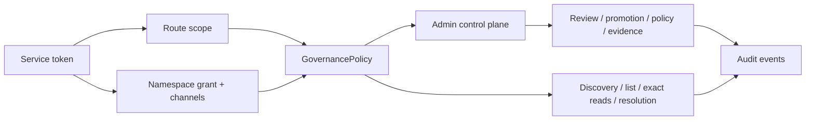
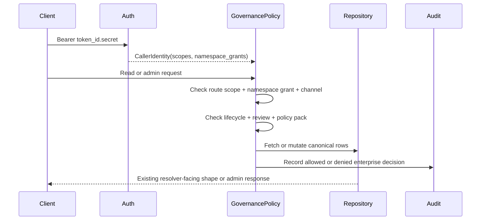

# Milestone 15 Changelog - Enterprise Security Airlock And Promotion Workflows

This changelog documents implementation of [.agents/plans/15-enterprise-security-airlock-and-promotion-workflows.md](../../.agents/plans/15-enterprise-security-airlock-and-promotion-workflows.md).

The milestone adds an enterprise governance control plane over the immutable registry. Resolver-facing reads keep their existing semantics, while namespace ownership, service-token grants, review state, promotion channels, policy-pack references, trust evidence, and audit records now govern which versions are visible.

## Scope Delivered

- Enterprise state now has explicit PostgreSQL tables and fields: [alembic/versions/0004_enterprise_governance.py](../../alembic/versions/0004_enterprise_governance.py), [app/persistence/models/organization.py](../../app/persistence/models/organization.py), [app/persistence/models/namespace.py](../../app/persistence/models/namespace.py), [app/persistence/models/policy_pack.py](../../app/persistence/models/policy_pack.py), [app/persistence/models/trust_evidence.py](../../app/persistence/models/trust_evidence.py).
- Service-token governance now supports `review` scope and namespace grants with promotion-channel limits: [app/core/settings.py](../../app/core/settings.py), [app/core/auth.py](../../app/core/auth.py), [app/core/governance.py](../../app/core/governance.py), [docs/reference/service-token-governance.md](../reference/service-token-governance.md).
- Admin control-plane routes were added under `/admin`: [app/interface/api/enterprise.py](../../app/interface/api/enterprise.py), [app/interface/dto/enterprise.py](../../app/interface/dto/enterprise.py), [app/main.py](../../app/main.py).
- Publish accepts optional `namespace`, `artifact_origin`, and `policy_pack_slug` governance inputs while preserving public internal defaults: [app/interface/dto/skills_publish.py](../../app/interface/dto/skills_publish.py), [app/interface/api/skill_api_support_publish.py](../../app/interface/api/skill_api_support_publish.py), [app/core/skills/registry.py](../../app/core/skills/registry.py).
- Discovery, version listing, exact metadata, exact content, and resolution enforce namespace, lifecycle, review, promotion, trust-tier, and policy-pack visibility without changing resolver payload semantics: [app/core/skills/search.py](../../app/core/skills/search.py), [app/core/skills/fetch.py](../../app/core/skills/fetch.py), [app/core/skills/resolution.py](../../app/core/skills/resolution.py), [app/core/skills/exact_read.py](../../app/core/skills/exact_read.py).
- Audit coverage now includes enterprise control-plane changes, trust evidence additions, and visibility denials with redacted actor context: [app/core/audit_events.py](../../app/core/audit_events.py), [app/core/skills/registry.py](../../app/core/skills/registry.py), [app/core/skills/exact_read.py](../../app/core/skills/exact_read.py).
- Canonical docs and manual Bruno assets were updated for the new route, schema, auth, workflow, and payload surfaces: [docs/reference/api-contract.md](../reference/api-contract.md), [docs/reference/enterprise-governance.md](../reference/enterprise-governance.md), [docs/reference/schema.md](../reference/schema.md), [bruno/environments/Dev.yml](../../bruno/environments/Dev.yml).

## Architecture Snapshot

## State Model

| State | Storage | Mutability | Role |
| --- | --- | --- | --- |
| `namespace` | `skills.namespace_fk` | mutable ownership | Namespace grant boundary for a skill identity. |
| `artifact_origin` | `skill_versions.artifact_origin` | publish-time | Distinguishes internal, imported, verified, and restricted artifacts. |
| `review_state` | `skill_versions.review_state` | mutable workflow | Keeps imported/rejected versions out of normal reader visibility. |
| `promotion_channel` | `skill_versions.promotion_channel` | mutable workflow | Separates `dev`, `staging`, and `prod` enterprise availability. |
| `policy_pack_slug` | `skill_versions.policy_pack_fk` and search projection | mutable reference | Attaches registry-enforced policy-pack visibility rules. |
| `trust_evidence` | `trust_evidence` | append-only | Stores evidence metadata and payloads without exposing raw payloads in responses. |

Lifecycle status, trust tier, review state, and promotion channel stay independent. Review does not imply promotion, promotion does not imply lifecycle support, and trust evidence does not imply approval. This decoupling allows flexible workflows and avoids combinatorial explosion of states.

## Runtime Flow

## Design Notes

- Enterprise governance is intentionally registry-side control-plane behavior. Discovery still returns candidate slugs only, resolution still returns authored `depends_on` selectors only, and exact content still returns the stored `.tar.zst` bytes.
- Namespace grants are explicit but backward compatible for existing public tokens: non-admin records without grants resolve to `public`/`prod` grants, while admin records receive a global bootstrap grant.
- Imported artifacts default to `pending_review` and `dev`, which creates an airlock without making resolver clients understand import state.
- Policy packs are deliberately narrow. The registry enforces documented visibility/trust rules from a `jsonb` reference; it does not execute arbitrary runtime policy code.
- `version_checksum.digest` is not recomputed for review, promotion, trust-tier, policy-pack, ownership, or trust-evidence changes. Audit rows are the source of post-publish governance history.

## Schema Reference

Source: [alembic/versions/0004_enterprise_governance.py](../../alembic/versions/0004_enterprise_governance.py), [docs/reference/schema.md](../reference/schema.md).

| Table / Column | Type | Constraint | Role |
| --- | --- | --- | --- |
| `organizations.id` | `bigint` | PK | Internal organization key. |
| `organizations.slug` | `text` | unique | Stable organization identifier. |
| `namespaces.id` | `bigint` | PK | Internal namespace key. |
| `namespaces.organization_fk` | `bigint` | FK | Organization owner. |
| `namespaces.visibility` | `text` | check | `public` or `private` namespace classification. |
| `skills.namespace_fk` | `bigint` | FK, indexed | Skill identity ownership boundary. |
| `skill_versions.artifact_origin` | `text` | check | Artifact source classification. |
| `skill_versions.review_state` | `text` | check | Review workflow state. |
| `skill_versions.promotion_channel` | `text` | check | Enterprise availability channel. |
| `skill_versions.policy_pack_fk` | `bigint` | FK, indexed | Optional policy-pack reference. |
| `policy_packs.rules` | `jsonb` | not null | Registry-enforced policy-pack rules. |
| `trust_evidence.payload` | `jsonb` | nullable | Server-retained raw evidence payload. |
| `skill_search_documents.namespace` | `text` | indexed | Discovery namespace filter. |
| `skill_search_documents.review_state` | `text` | indexed | Discovery review filter. |
| `skill_search_documents.promotion_channel` | `text` | indexed | Discovery channel filter. |

## Verification Notes

- Unit coverage exercises namespace-grant parsing, namespace/channel denials, imported artifact visibility, OpenAPI route registration, and unchanged exact-read/resolution semantics: [tests/unit/test_governance.py](../../tests/unit/test_governance.py), [tests/unit/test_registry_api_boundary.py](../../tests/unit/test_registry_api_boundary.py), [tests/unit/test_skill_fetch_service.py](../../tests/unit/test_skill_fetch_service.py), [tests/unit/test_skill_resolution_service.py](../../tests/unit/test_skill_resolution_service.py).
- Integration coverage exercises migration upgrade/downgrade, public default backfill, private namespace hiding, imported artifact approval/promotion, trust evidence, policy-pack visibility, and audit rows with request ids: [tests/integration/test_migrations.py](../../tests/integration/test_migrations.py), [tests/integration/test_skill_registry_endpoints.py](../../tests/integration/test_skill_registry_endpoints.py).
- Verification commands run during this implementation:
  - `uv --cache-dir .uv-cache run --extra dev pytest tests/unit/test_governance.py tests/unit/test_registry_api_boundary.py tests/unit/test_api_contract_examples.py tests/unit/test_public_contract_docs.py -q` -> `32 passed`.
  - `uv --cache-dir .uv-cache run --extra dev pytest tests/unit -q` -> `170 passed`.
  - `uv --cache-dir .uv-cache run --extra dev pytest tests/integration -q` -> `1 passed, 30 skipped` because the standalone Postgres test URL was not reachable before the managed test database was started.
  - `make quality` -> Ruff format/check and mypy passed.
  - `make test` -> managed test database full gate passed with `201 passed`.
