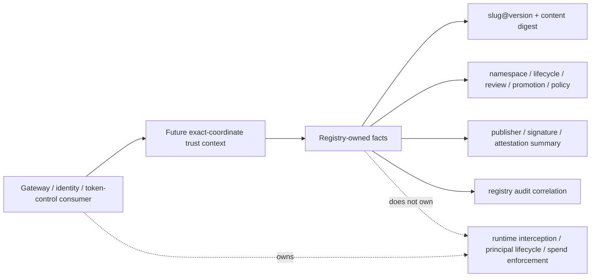

# Milestone 16 Changelog - Registry Trust Consumer Contracts

This changelog documents the contract-definition work captured in
[.agents/plans/16-registry-trust-consumer-contracts.md](../../.agents/plans/16-registry-trust-consumer-contracts.md).

The milestone defines how downstream gateway, identity, token-control, and
audit surfaces should consume registry-owned trust facts without moving runtime
interception, principal lifecycle, spend enforcement, or execution control into
the registry service.

## Scope Delivered

- Defined the trust-consumer context for one exact artifact coordinate:
  `slug`, `version`, content digest, artifact media type, namespace ownership,
  lifecycle status, promotion channel, trust tier, policy-pack reference,
  publisher identity, signature/attestation summary, and audit correlation
  fields: [.agents/plans/16-registry-trust-consumer-contracts.md](../../.agents/plans/16-registry-trust-consumer-contracts.md).
- Placed the trust-consumer contract after enterprise governance in the roadmap
  so consumers build on namespaces, review, promotion, policy packs, trust
  evidence, and audit rather than duplicating registry tables:
  [.agents/plans/roadmap.md](../../.agents/plans/roadmap.md),
  [docs/reference/enterprise-governance.md](../reference/enterprise-governance.md).
- Preserved the registry/resolver boundary. Discovery remains candidate
  generation, resolution remains authored direct dependency reads, and exact
  fetch remains immutable coordinate lookup:
  [docs/architecture/server-resolver-boundary.md](../architecture/server-resolver-boundary.md),
  [docs/reference/api-contract.md](../reference/api-contract.md).
- Recorded deployment-facing constraints for future trust-consumer work: the
  stable Render/Neon API host can serve future exact-coordinate trust-context
  reads, but gateway, identity, and token-control runtime responsibilities stay
  outside this service:
  [docs/architecture/render-neon-deployment.md](../architecture/render-neon-deployment.md).

## Architecture Snapshot

## Design Notes

- Trust consumers should ask about an exact `slug@version` coordinate, not fuzzy
  discovery results. This keeps runtime authorization and attribution anchored
  to immutable artifact identity.
- The registry exposes authoritative artifact, namespace, governance,
  provenance, and audit facts. Downstream products own runtime decisions and
  should not mutate immutable artifact records.
- The contract intentionally avoids leaking full internal schema shapes. The
  future consumer payload should be compact enough to cache and reason about
  without becoming a mutable runtime plan.
- Plan 16 is a contract-definition milestone. It does not add gateway
  interception, identity issuance, token-budget enforcement, billing ledgers,
  sandboxing, resolver reranking, dependency solving, or execution planning.

## Schema Reference

No database migration, table, column, DTO, or public route was added by this
milestone.

The future trust-consumer contract is expected to project existing and future
registry-owned facts rather than copy downstream runtime state into registry
storage:

| Fact group | Current source of truth | Role for consumers |
| --- | --- | --- |
| Artifact coordinate | `skills`, `skill_versions`, and content checksum state documented in [docs/reference/schema.md](../reference/schema.md) | Identifies the exact immutable artifact version being evaluated. |
| Governance visibility | Namespace, lifecycle, review, promotion, trust-tier, and policy-pack state documented in [docs/reference/enterprise-governance.md](../reference/enterprise-governance.md) | Lets consumers decide whether a principal can load or attribute usage to a governed artifact. |
| Provenance and trust evidence | Publish-time provenance and append-only trust evidence documented in [docs/reference/api-contract.md](../reference/api-contract.md) and [docs/reference/enterprise-governance.md](../reference/enterprise-governance.md) | Provides publisher, signature, attestation, and evidence context without making consumers copy registry tables. |
| Audit correlation | Registry audit events documented in [docs/reference/enterprise-governance.md](../reference/enterprise-governance.md) | Allows downstream runtime events to correlate back to publish, approval, promotion, policy, and trust-evidence history. |

## Verification Notes

- No runtime verification was required because this milestone delivered the
  contract plan, not implementation code.
- Source inspection confirmed no Plan 16-specific route, DTO, migration, or test
  surface was added under `app/`, `alembic/`, or `tests/`.
- The current public API contract remains unchanged:
  [docs/reference/api-contract.md](../reference/api-contract.md).
