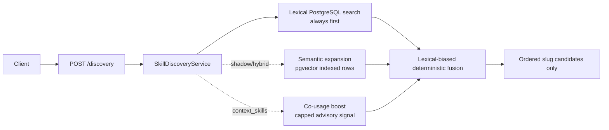
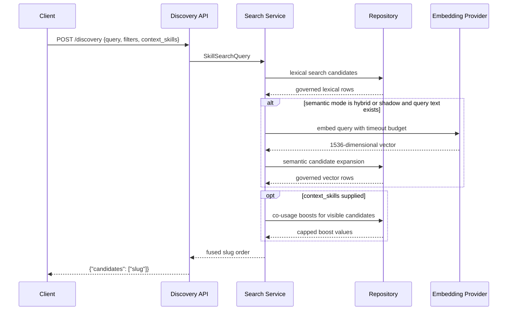

# Milestone 17 Changelog - Lexical-Primary Semantic Expansion And Co-Usage Discovery

This changelog documents implementation of [.agents/plans/17-hybrid-semantic-and-co-usage-discovery.md](../../.agents/plans/17-hybrid-semantic-and-co-usage-discovery.md).

The milestone keeps `POST /discovery` as the only public discovery route and preserves its slug-only response shape. Deterministic PostgreSQL lexical ranking remains the primary path; semantic retrieval is a flag-gated recall-expansion layer, and co-usage is a bounded advisory boost only when caller context is supplied.

## Scope Delivered

- Discovery requests now accept optional `context_skills` while responses remain `{"candidates": [...]}`: [app/interface/dto/skills_discovery.py](../../app/interface/dto/skills_discovery.py), [app/interface/api/discovery.py](../../app/interface/api/discovery.py), [app/core/skills/discovery.py](../../app/core/skills/discovery.py).
- Lexical discovery still runs first through the existing PostgreSQL search document path, including exact slug/name precedence, metadata full-text ranking, governance filters, deterministic tie-breakers, and per-slug collapse: [app/core/skills/search.py](../../app/core/skills/search.py), [app/persistence/skill_registry_repository_support.py](../../app/persistence/skill_registry_repository_support.py), [app/persistence/skill_registry_repository.py](../../app/persistence/skill_registry_repository.py).
- Semantic retrieval is wired behind `SEMANTIC_DISCOVERY_MODE=off|shadow|hybrid`, defaults to `off`, validates 1536-dimensional vectors, catches provider failures, and never blocks publish success. Internal ports now cover embedding generation, embedding indexing, semantic retrieval, and co-usage observation import: [app/core/settings.py](../../app/core/settings.py), [app/core/ports.py](../../app/core/ports.py), [app/core/skills/search.py](../../app/core/skills/search.py), [app/persistence/skill_registry_repository.py](../../app/persistence/skill_registry_repository.py).
- A thin pgvector read model records pending metadata-only embedding sources on publish and searches only indexed embeddings that pass the same governance filters as lexical results: [alembic/versions/0005_semantic_discovery_signals.py](../../alembic/versions/0005_semantic_discovery_signals.py), [app/intelligence/discovery_signals.py](../../app/intelligence/discovery_signals.py), [app/persistence/skill_registry_repository.py](../../app/persistence/skill_registry_repository.py).
- Co-usage storage and bounded boost lookup were added for resolver lock/selection-derived observations. The ranking service applies boosts only when `context_skills` is provided and caps their influence: [alembic/versions/0005_semantic_discovery_signals.py](../../alembic/versions/0005_semantic_discovery_signals.py), [app/core/skills/search.py](../../app/core/skills/search.py), [app/intelligence/discovery_signals.py](../../app/intelligence/discovery_signals.py).
- Canonical discovery, API, schema, and persistence docs now describe the lexical-primary model, optional semantic expansion, and co-usage boundary: [docs/architecture/discovery-and-ranking.md](../architecture/discovery-and-ranking.md), [docs/reference/api-contract.md](../reference/api-contract.md), [docs/reference/schema.md](../reference/schema.md), [app/persistence/models/README.md](../../app/persistence/models/README.md).

## Architecture Snapshot

Why this shape:

- Lexical ranking stays deterministic and cheap by default. The semantic branch is optional work controlled by settings and can fail closed to lexical-only behavior.
- Semantic data is derived from metadata fields only: slug, name, description, and tags. Raw markdown bodies are not embedded or exposed through discovery ranking.
- Co-usage is deliberately named as a correlation signal, not dependency truth. It can improve "commonly used together" ordering only when the caller supplies current skill context.

## Runtime Flow

## Design Notes

- Exact slug and exact name matches remain ahead of semantic-only results. Strong lexical candidates are not demoted just because a vector neighbor exists.
- Raw cosine distance is not compared directly with lexical score. Fusion uses lexical rank as the primary component, semantic rank as a small recall signal, and co-usage as a capped boost: [app/intelligence/discovery_signals.py](../../app/intelligence/discovery_signals.py).
- `shadow` mode executes semantic retrieval but intentionally returns lexical ordering, giving operators a low-risk way to observe provider and indexing behavior before enabling `hybrid`.
- The service has an internal `EmbeddingProviderPort`, but the default container does not wire a provider. That keeps semantic search thin and inactive until a concrete provider/indexing job is introduced: [app/service_container.py](../../app/service_container.py), [app/core/ports.py](../../app/core/ports.py).
- Publish writes pending embedding metadata and source checksums, not vectors. Provider failures or missing providers cannot block successful publish: [app/persistence/skill_registry_repository.py](../../app/persistence/skill_registry_repository.py).

## Schema Reference

Source: [alembic/versions/0005_semantic_discovery_signals.py](../../alembic/versions/0005_semantic_discovery_signals.py).

### `skill_search_embeddings`

| Field | Type | Nullable | Default / Constraint | Role |
| --- | --- | --- | --- | --- |
| `skill_version_fk` | `bigint` | No | FK to `skill_versions.id`, part of PK | Pins one derived embedding row to one immutable skill version. |
| `embedding_model` | `text` | No | Part of PK | Separates embedding generations by model without changing public discovery contracts. |
| `embedding_dimensions` | `integer` | No | Check-constrained to `1536` | Locks the first vector shape and prevents mixed-dimension index rows. |
| `source_checksum_digest` | `text` | No | SHA-256 check | Detects stale embeddings when metadata source text changes. |
| `embedding_vector` | `halfvec(1536)` | Yes | HNSW cosine index when indexed | Stores the compact semantic vector used only for candidate expansion. |
| `index_status` | `text` | No | `pending`, `indexed`, `failed`, or `stale` | Lets publish enqueue derived work without requiring immediate provider success. |
| `indexed_at` / `last_error` | `timestamptz` / `text` | Yes | Optional | Records indexing completion or failure diagnostics for operators. |

### `skill_usage_observation_runs`

| Field | Type | Nullable | Default / Constraint | Role |
| --- | --- | --- | --- | --- |
| `id` | `bigint` | No | Identity PK | Identifies one imported resolver evidence snapshot. |
| `source` | `text` | No | Unique with `source_digest` | Names the trusted import source, such as resolver lock or selection outcomes. |
| `source_digest` | `text` | No | SHA-256 check | Deduplicates imported observations. |
| `observed_at` | `timestamptz` | No | Required | Preserves when the resolver evidence was observed. |

### `skill_usage_observations`

| Field | Type | Nullable | Default / Constraint | Role |
| --- | --- | --- | --- | --- |
| `run_fk` | `bigint` | No | FK to observation run | Groups selected skills that appeared together in one trusted resolver outcome. |
| `skill_fk` | `bigint` | No | FK to `skills.id`, unique with run | Links the observation to canonical skill identity. |
| `skill_slug` | `text` | No | Required | Keeps a readable import trace beside the canonical FK. |

### `skill_co_usage_pairs`

| Field | Type | Nullable | Default / Constraint | Role |
| --- | --- | --- | --- | --- |
| `anchor_skill_fk` / `related_skill_fk` | `bigint` | No | Composite PK, distinct-skills check | Stores directional "commonly used with" aggregates for context-aware discovery. |
| `observation_count` / `distinct_run_count` | `bigint` | No | Non-negative check | Records the evidence volume behind a pair. |
| `co_usage_rate` / `lift_score` / `pmi_score` | `numeric(10,6)` | No | Defaults to `0` | Holds bounded ranking inputs without treating them as dependency edges. |
| `last_observed_at` / `window_days` | `timestamptz` / `integer` | Yes / No | Positive window check | Defines the aggregation freshness window. |

## Verification Notes

- Pure fusion, vector validation, checksum, exact-match precedence, semantic fallback, shadow mode, hybrid recall, and co-usage cap behavior are covered by [tests/unit/test_discovery_signals.py](../../tests/unit/test_discovery_signals.py), [tests/unit/test_skill_search_service.py](../../tests/unit/test_skill_search_service.py), and [tests/unit/test_settings.py](../../tests/unit/test_settings.py).
- Request normalization and contract-example drift are covered by [tests/unit/test_skill_manifest.py](../../tests/unit/test_skill_manifest.py) and [tests/unit/test_api_contract_examples.py](../../tests/unit/test_api_contract_examples.py).
- Migration and publish-time pending embedding rows are covered by [tests/integration/test_migrations.py](../../tests/integration/test_migrations.py) and [tests/integration/test_skill_registry_endpoints.py](../../tests/integration/test_skill_registry_endpoints.py).
- Verification commands run during this implementation:
  - `UV_CACHE_DIR=.uv-cache uv run --extra dev pytest tests/unit/test_discovery_signals.py tests/unit/test_skill_search_service.py tests/unit/test_settings.py::test_settings_load_valid_environment tests/unit/test_settings.py::test_settings_validate_semantic_discovery_controls tests/unit/test_skill_manifest.py::test_discovery_request_trims_name_and_deduplicates_tags tests/unit/test_api_contract_examples.py tests/integration/test_migrations.py tests/integration/test_skill_registry_endpoints.py::test_publish_discovery_resolution_and_exact_fetch -q` -> `29 passed`.
  - `UV_CACHE_DIR=.uv-cache uv run --extra dev pytest tests/unit/test_public_contract_docs.py tests/unit/test_docs_docker_quickstart.py -q` -> `5 passed`.
  - `UV_CACHE_DIR=.uv-cache uv run --extra dev mypy app` -> `Success: no issues found in 83 source files`.
  - `UV_CACHE_DIR=.uv-cache uv run --extra dev ruff format --check app tests alembic/versions/0005_semantic_discovery_signals.py` -> `130 files already formatted`.
