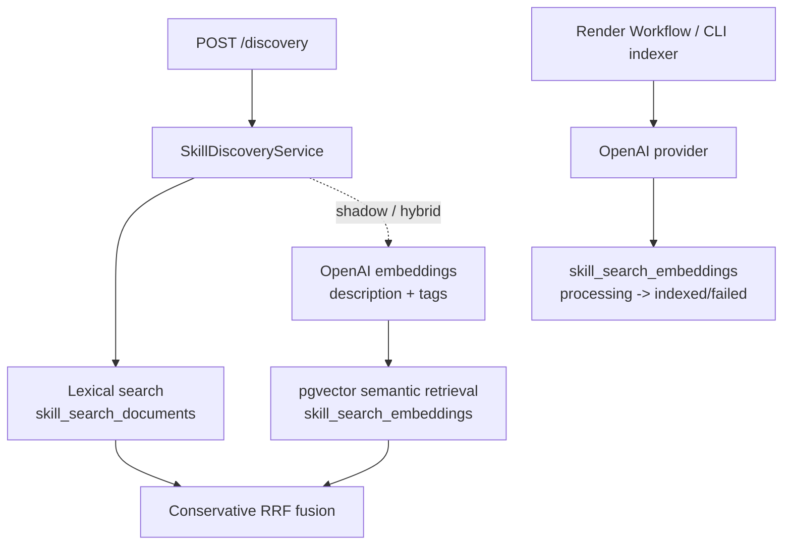
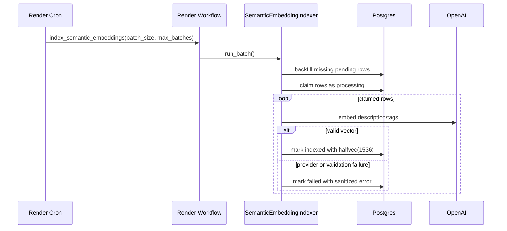

# Milestone 18 Changelog - OpenAI Description/Tag Semantic Discovery

This changelog documents implementation of
[Plan 18 - OpenAI Description/Tag Semantic Discovery](../../.agents/plans/18-openai-description-tag-semantic-discovery.md).

## Scope Delivered

- Semantic discovery now uses a concrete OpenAI provider behind the existing
  port, while `POST /discovery` keeps its slug-only response shape:
  [app/integrations/openai_embeddings.py](../../app/integrations/openai_embeddings.py),
  [app/service_container.py](../../app/service_container.py),
  [app/core/skills/search.py](../../app/core/skills/search.py).
- Embedding source text is now description/tag-only. Slug and name remain
  lexical identity signals, not semantic input:
  [app/intelligence/discovery_signals.py](../../app/intelligence/discovery_signals.py),
  [app/core/skills/discovery.py](../../app/core/skills/discovery.py).
- The embedding indexer can backfill, claim `processing` work, index vectors,
  and record failures without blocking publish:
  [app/core/skills/embedding_indexing.py](../../app/core/skills/embedding_indexing.py),
  [app/persistence/skill_registry_repository.py](../../app/persistence/skill_registry_repository.py),
  [alembic/versions/0006_embedding_processing_status.py](../../alembic/versions/0006_embedding_processing_status.py).
- Production operation has a local CLI fallback and Render Workflow task:
  [scripts/index_semantic_embeddings.py](../../scripts/index_semantic_embeddings.py),
  [workflows/semantic_embeddings.py](../../workflows/semantic_embeddings.py),
  [scripts/trigger_semantic_embedding_workflow.py](../../scripts/trigger_semantic_embedding_workflow.py).

## Architecture Snapshot

Why this shape:

- The registry remains a governed candidate generator; resolver-side final
  choice and reranking stay outside the request path.
- Hybrid mode uses conservative reciprocal rank fusion across lexical and
  semantic rank positions. Exact slug/name matches still win, and semantic
  provider or semantic SQL failures degrade to lexical-only discovery results.
- OpenAI availability is not part of publish success. Publish creates/reuses
  derived rows; indexing happens after commit.
- The persisted embedding key
  `openai:text-embedding-3-small:description-tags-v1` separates provider,
  model, and source-contract compatibility from the OpenAI model name.

## Runtime Flow

## Design Notes

- Missing `OPENAI_API_KEY` values warn and fall back to lexical-only discovery
  even when `SEMANTIC_DISCOVERY_MODE` is `shadow` or `hybrid`:
  [app/core/settings.py](../../app/core/settings.py).
- The semantic query source for discovery is `description + tags`; the required
  `name` is lexical-only so identity wording does not distort embeddings:
  [app/core/skills/discovery.py](../../app/core/skills/discovery.py).
- `processing` is a claim state, not a durable success state. Workers claim and
  commit before calling OpenAI, avoiding long database locks during provider
  latency:
  [app/persistence/skill_registry_repository.py](../../app/persistence/skill_registry_repository.py).
- Render SDK dependencies stay in the `workflow` optional extra, while the web
  app runtime only adds the OpenAI SDK:
  [pyproject.toml](../../pyproject.toml).

## Schema Reference

Source:
[alembic/versions/0006_embedding_processing_status.py](../../alembic/versions/0006_embedding_processing_status.py).

### `skill_search_embeddings`

| Field | Type | Nullable | Default / Constraint | Role |
| --- | --- | --- | --- | --- |
| `embedding_model` | `text` | No | PK component | Stores the full semantic index key, not just the provider model. |
| `source_checksum_digest` | `text` | No | SHA-256 check | Detects stale description/tag source text. |
| `embedding_vector` | `halfvec(1536)` | Yes | HNSW indexed when `indexed` | Stores the compact vector used for semantic candidate expansion. |
| `index_status` | `text` | No | `pending`, `processing`, `indexed`, `failed`, `stale` | Tracks async indexing lifecycle and safe worker claims. |
| `last_error` | `text` | Yes | none | Stores sanitized indexing failure class/message. |

## Verification Notes

- Unit coverage covers source construction, settings validation, OpenAI provider
  calls, discovery semantic query source, provider/semantic SQL fallback
  behavior, conservative RRF fusion, and indexing
  orchestration:
  [tests/unit/test_discovery_signals.py](../../tests/unit/test_discovery_signals.py),
  [tests/unit/test_settings.py](../../tests/unit/test_settings.py),
  [tests/unit/test_openai_embedding_provider.py](../../tests/unit/test_openai_embedding_provider.py),
  [tests/unit/test_skill_search_service.py](../../tests/unit/test_skill_search_service.py),
  [tests/unit/test_semantic_embedding_indexer.py](../../tests/unit/test_semantic_embedding_indexer.py).
- Integration coverage checks the migration status constraint and repository
  claim/index/failure behavior against the pgvector-backed test database:
  [tests/integration/test_migrations.py](../../tests/integration/test_migrations.py),
  [tests/integration/test_semantic_embedding_indexing.py](../../tests/integration/test_semantic_embedding_indexing.py).
