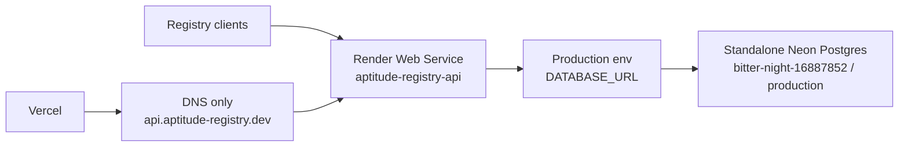

# Autonomous Neon Registry DB Cutover Changelog

This changelog records the production database cutover from the deleted
Vercel-managed Neon project to a standalone Neon Console-managed project.

## Scope Delivered

- Created standalone Neon organization/project resources for the registry DB:
  organization `Aptitude` / `org-wild-pond-20247201`, project
  `aptitude-registry` / `bitter-night-16887852`, production branch
  `br-calm-bonus-ambx0ki5`, database `aptitude`, and role `aptitude_app`.
- Kept the cutover schema-only. No data was copied from the deleted
  Vercel-managed Neon project.
- Ran Alembic manually against the new direct Neon connection and reached
  `0003_skill_bundle_storage (head)`.
- Updated Render service `aptitude-registry-api` /
  `srv-d7pqsd7avr4c73bfb8t0` so `DATABASE_URL` points at the standalone Neon
  production branch, then deployed `dep-d7q5lqdckfvc739isqpg`.

## Runtime State

## Verification Notes

- `APP_SETTINGS_ENV_FILE=/private/tmp/aptitude-registry-prod.env UV_CACHE_DIR=.uv-cache uv run alembic upgrade head`
  applied migrations `0001_initial_schema`, `0002_skill_install_counts`, and
  `0003_skill_bundle_storage`.
- `APP_SETTINGS_ENV_FILE=/private/tmp/aptitude-registry-prod.env UV_CACHE_DIR=.uv-cache uv run alembic current`
  reported `0003_skill_bundle_storage (head)`.
- `https://aptitude-registry-api.onrender.com/healthz` returned `200` with
  `"environment":"prod"`.
- `https://aptitude-registry-api.onrender.com/readyz` returned `200` with the
  database check `ok`.
- `https://aptitude-registry-api.onrender.com/docs` returned `404`, matching
  production docs-disabled posture.
- `api.aptitude-registry.dev` resolves toward Render, but HTTPS checks still
  return a TLS handshake failure from the current environment; use the Render
  subdomain as the live verification endpoint until custom-domain TLS is stable.

## Follow-Up

- Re-check `https://api.aptitude-registry.dev/healthz` after Render custom-domain
  TLS propagation settles.
- Keep the Render `onrender.com` hostname in `ALLOWED_HOSTS_JSON` until the API
  subdomain is verified end to end.
