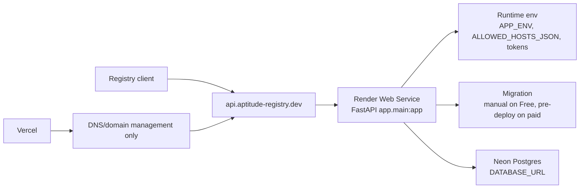
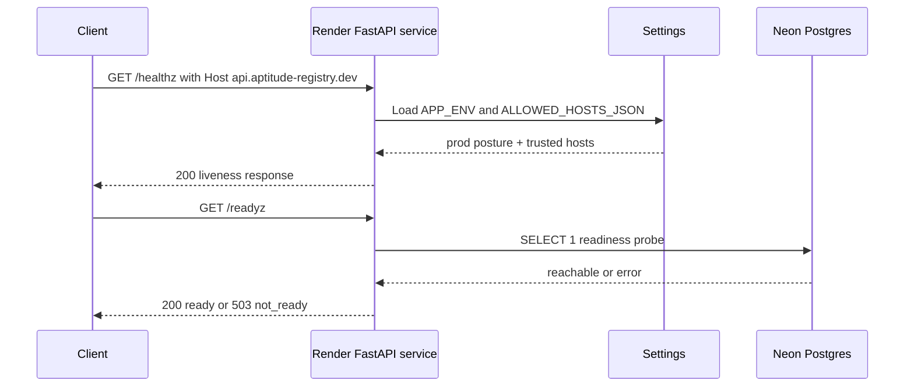

# Deployment Changelog - Render and Neon Deployment Readiness

This changelog documents the deployment-readiness work captured in
[docs/reference/render-neon-deployment.md](../reference/render-neon-deployment.md).

The change makes Render plus Neon the documented production deployment path for
the registry API, removes the tracked Vercel serverless deployment surface, and
keeps Vercel scoped to DNS/domain management until a website or docs app exists.
It also records the first live Render and Neon deployment attempt on
2026-04-30 and the follow-up standalone Neon cutover on 2026-05-01.

## Scope Delivered

- Added a canonical deployment reference for the production API host
  `https://api.aptitude-registry.dev`, Render Web Service settings, Neon
  database setup, DNS wiring, and endpoint verification:
  [docs/reference/render-neon-deployment.md](../reference/render-neon-deployment.md),
  [docs/reference/README.md](../reference/README.md).
- Updated runtime and auth documentation so `APP_ENV=prod` host allowlisting
  points at the API subdomain and keeps the Render `onrender.com` host during
  rollout:
  [.env.example](../../.env.example),
  [docs/reference/runtime-profiles.md](../reference/runtime-profiles.md),
  [docs/reference/service-token-governance.md](../reference/service-token-governance.md).
- Removed the Vercel Python Function deployment surface because Vercel is no
  longer the app host:
  `api/index.py`,
  `server.py`,
  `vercel.json`,
  `.vercelignore`,
  [tests/unit/test_ci_workflows.py](../../tests/unit/test_ci_workflows.py).
- Removed direct runtime dependencies on deployment/tooling packages that are
  not needed by the Render-hosted app process:
  [pyproject.toml](../../pyproject.toml),
  [uv.lock](../../uv.lock),
  [tests/unit/test_dependency_manifest.py](../../tests/unit/test_dependency_manifest.py).
- Created the first live Render Web Service and Neon production database
  resources through CLI-driven deployment work:
  [docs/reference/render-neon-deployment.md](../reference/render-neon-deployment.md).
- Cut production over to a standalone Neon Console-managed project after the
  Vercel-managed Neon project was removed:
  [autonomous-neon-registry-db-cutover-changelog.md](autonomous-neon-registry-db-cutover-changelog.md).

## Architecture Snapshot

Why this shape:

- The backend is already a conventional FastAPI service with a stable import
  string and runtime settings layer, so a persistent web service is the lowest
  friction deployment target:
  [app/main.py](../../app/main.py),
  [pyproject.toml](../../pyproject.toml),
  [docs/reference/render-neon-deployment.md](../reference/render-neon-deployment.md).
- Postgres remains external infrastructure. The app reads `DATABASE_URL`,
  Alembic resolves migrations through the same settings path, and readiness
  probes the database at runtime:
  [app/core/settings.py](../../app/core/settings.py),
  [alembic/env.py](../../alembic/env.py),
  [app/interface/api/health.py](../../app/interface/api/health.py).
- Vercel deployment artifacts were removed so the repo cannot accidentally
  redeploy the API through the old serverless path while the domain is being
  moved to Render:
  [tests/unit/test_ci_workflows.py](../../tests/unit/test_ci_workflows.py).

## Runtime Flow

## Design Notes

- The production URL is now the API subdomain, not the root domain. That keeps
  `aptitude-registry.dev` available for a future website or redirect and avoids
  mixing API hosting with a frontend that does not exist yet:
  [docs/reference/runtime-profiles.md](../reference/runtime-profiles.md),
  [docs/reference/render-neon-deployment.md](../reference/render-neon-deployment.md).
- Render remains the documented app host because it supports the current
  persistent FastAPI plus Alembic plus Postgres shape without porting the
  request model:
  [docs/reference/render-neon-deployment.md](../reference/render-neon-deployment.md).
- Neon pooling is intentionally deferred. The documented first deployment uses a
  direct Neon connection for both runtime and migrations so Alembic does not run
  through a pooled `-pooler` endpoint:
  [docs/reference/render-neon-deployment.md](../reference/render-neon-deployment.md),
  [alembic/env.py](../../alembic/env.py).
- Render Free does not execute configured pre-deploy commands. The live
  deployment keeps the command documented for paid services, but the initial
  migration was run manually against Neon before endpoint verification:
  [docs/reference/render-neon-deployment.md](../reference/render-neon-deployment.md).
- The initial Neon organization was managed by Vercel and rejected creation of
  a separate `aptitude-registry` project. Production has since been cut over to
  a standalone Neon Console-managed project with its own `production` branch,
  `aptitude` database, and `aptitude_app` role:
  [docs/reference/render-neon-deployment.md](../reference/render-neon-deployment.md).
- CORS remains disabled because no browser client exists. The deployment work
  changes host and infrastructure guidance, not the public HTTP route contract:
  [docs/reference/render-neon-deployment.md](../reference/render-neon-deployment.md),
  [docs/reference/api-contract.md](../reference/api-contract.md).
- `fastapi-cloud-cli` is no longer a direct project dependency, but it can still
  appear transitively through `fastapi[standard]`. Removing it fully would
  require a separate dependency/start-command decision:
  [pyproject.toml](../../pyproject.toml),
  [uv.lock](../../uv.lock).

## Schema Reference

Source:
[app/core/settings.py](../../app/core/settings.py),
[docs/reference/render-neon-deployment.md](../reference/render-neon-deployment.md),
[.env.example](../../.env.example).

### Deployment environment contract

| Field | Type | Nullable | Default / Constraint | Role |
| --- | --- | --- | --- | --- |
| `APP_ENV` | `string` | No | `prod` for Render | Enables production posture, including disabled docs and trusted-host enforcement. |
| `DATABASE_URL` | `string` | No | Neon direct connection using `postgresql+psycopg://...` | Gives the app and Alembic the primary PostgreSQL connection string. |
| `AUTH_SERVICE_TOKENS_JSON` | `JSON array` | No | token records with sha256 secret digests | Supplies governed bearer-token records for protected API routes and `/metrics`. |
| `ALLOWED_HOSTS_JSON` | `JSON array[string]` | No in `prod` | includes `api.aptitude-registry.dev` and rollout Render host | Defines accepted `Host` headers for `TrustedHostMiddleware`. |
| `ACTIVE_POLICY_PROFILE` | `string` | No | `default` | Selects the active governance policy profile without changing route shape. |
| `LOG_FORMAT` | `string` | No | `auto` | Keeps Render production logs structured through the existing logging settings. |

### Live infrastructure resources

| Resource | Current value | Role |
| --- | --- | --- |
| Render service | `aptitude-registry-api` / `srv-d7pqsd7avr4c73bfb8t0` | Persistent FastAPI web service running `app.main:app`. |
| Render deploy | `dep-d7q5lqdckfvc739isqpg` / `fe0c54c996c2e973214892f59047ac17fb255293` | Live deploy after standalone Neon `DATABASE_URL` cutover. |
| Render branch tracking | `master` in service metadata | Auto-deploy remains enabled for the tracked branch. |
| Render URL | `https://aptitude-registry-api.onrender.com` | Verified fallback host while custom-domain TLS is pending. |
| Neon organization | `Aptitude` / `org-wild-pond-20247201` | Standalone Neon Console-managed organization. |
| Neon project | `aptitude-registry` / `bitter-night-16887852` | Standalone project that hosts production database resources. |
| Neon branch | `production` / `br-calm-bonus-ambx0ki5` | Production-isolated database branch for the registry API. |
| Neon database | `aptitude` | Application database used by SQLAlchemy and Alembic. |
| Neon role | `aptitude_app` | Application database role used in `DATABASE_URL`. |
| API domain | `api.aptitude-registry.dev` | Vercel DNS CNAME resolves toward Render, but HTTPS still returns a TLS handshake failure from the current environment. |

### Removed Vercel deployment files

| File | Previous role | Current role |
| --- | --- | --- |
| `api/index.py` | Vercel Python Function import wrapper for `app.main:app`. | Removed so Vercel no longer has an app entrypoint in this repo. |
| `server.py` | Alternate Vercel FastAPI entrypoint. | Removed with the old Vercel hosting path. |
| `vercel.json` | Vercel deployment filter and region configuration. | Removed because Vercel is DNS-only for this project now. |
| `.vercelignore` | Upload filter for Vercel Function deployments. | Removed because no Vercel deployment package is produced. |

## Verification Notes

- Dependency-boundary coverage now asserts `ruff` and `fastapi-cloud-cli` are
  not direct runtime dependencies while `ruff` remains available through the
  dev extra:
  [tests/unit/test_dependency_manifest.py](../../tests/unit/test_dependency_manifest.py).
- CI workflow coverage now asserts Vercel deployment commands stay absent and
  the old serverless deployment files do not exist:
  [tests/unit/test_ci_workflows.py](../../tests/unit/test_ci_workflows.py).
- Local verification for the deployment-prep patch passed:
  `UV_CACHE_DIR=.uv-cache uv run --extra dev ruff check .`,
  `UV_CACHE_DIR=.uv-cache uv run --extra dev ruff format --check .`,
  `UV_CACHE_DIR=.uv-cache uv run --extra dev python -m mypy app`,
  `UV_CACHE_DIR=.uv-cache uv run --extra dev python -m pytest tests/unit -q`,
  and `UV_CACHE_DIR=.uv-cache uv lock --check`.
- Live Render verification passed for
  `https://aptitude-registry-api.onrender.com/healthz`,
  `https://aptitude-registry-api.onrender.com/readyz`,
  `https://aptitude-registry-api.onrender.com/docs`,
  authenticated `/metrics`, and unauthenticated `/metrics`.
- Standalone Neon cutover verification passed for
  `https://aptitude-registry-api.onrender.com/healthz`,
  `https://aptitude-registry-api.onrender.com/readyz`, and
  `https://aptitude-registry-api.onrender.com/docs` after Render deploy
  `dep-d7q5lqdckfvc739isqpg`.
- Render was first created against `master`, then redeployed explicitly to
  commit `33b4e10866e50b005a0aca19868e11862ed604d3` from
  `feature/deployment-exploration` because the Render CLI did not persist the
  requested branch update.
- Neon migrations were applied manually for the Render Free deployments and
  `alembic current` reported `0003_skill_bundle_storage (head)`.
- DNS cutover configuration is complete: Vercel DNS has
  `api CNAME aptitude-registry-api.onrender.com`, public resolvers return the
  Render CNAME, and Render reports `api.aptitude-registry.dev` as verified.
  Public HTTPS endpoint verification is still pending because the current
  environment gets a TLS handshake failure from the Render edge.
