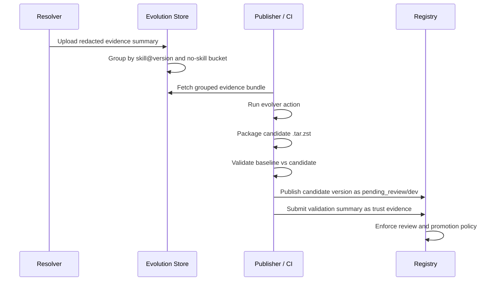

# Collective Skill Evolution Architecture Draft

> Status: draft/future-looking context only.
> This file is not the current source of truth for the live registry contract.
> Use [`../architecture/server-resolver-boundary.md`](../architecture/server-resolver-boundary.md),
> [`../reference/api-contract.md`](../reference/api-contract.md), and
> [`../reference/schema.md`](../reference/schema.md) for the live baseline.

This draft adapts the core idea from SkillClaw-style collective skill
evolution to Aptitude.

The useful idea is not "let an LLM edit skills". The useful system loop is:

```text
interaction evidence -> grouped skill evidence -> conservative candidate mutation -> validation -> controlled deployment
```

Aptitude should adopt that loop only through its existing product boundaries:

- `aptitude-resolver` captures redacted execution evidence and consumes only
  policy-eligible promoted versions.
- `aptitude-publisher` owns the evolver harness, candidate packaging,
  validation, and candidate publication.
- `Aptitude Registry` stores immutable candidate versions, lifecycle state,
  governance state, and validation or trust evidence.
- A separate evolution store keeps durable redacted session evidence and grouped
  evolution workspaces.

The registry must not become an agent runtime, telemetry warehouse, raw session
store, or autonomous skill editor.

## 1. Recommendation

Use a governed evolution loop, not full automatic synchronization.

SkillClaw assumes that validated improvements can be synchronized broadly to the
shared skill pool. That is reasonable for a research benchmark. It is a bad
default for Aptitude because Aptitude is trying to be governed infrastructure,
not a self-mutating prompt library.

Recommended posture:

- collect redacted evidence summaries, not raw trajectories
- group evidence outside the registry
- generate candidate skill versions offline through publisher-controlled jobs
- validate candidate versions against baselines before promotion
- publish evolved skills as new immutable `.tar.zst` versions
- expose them through existing registry governance only after review and
  namespace-specific promotion
- keep lockfiles pinned to exact versions so evolution never breaks replay

Critical rule:

> Evolved skills are new immutable versions. They never rewrite an existing
> `skill@version`.

## 2. Architecture Decisions

| Decision | Choice | Reason |
| --- | --- | --- |
| Evolution posture | Governed loop | Preserves enterprise trust while still allowing collective improvement. |
| Evidence shape | Redacted trajectory summaries | Keeps causal signal without centralizing raw prompts, files, or tool outputs. |
| Promotion model | Namespace-gated `dev -> staging -> prod` | Matches current registry governance vocabulary and avoids global accidental rollout. |
| Evidence storage | Separate evolution store | Prevents registry scope creep into telemetry and runtime trace storage. |
| Validation owner | Publisher/CI validator | Keeps execution and replay outside the registry. |
| Registry role | Immutable catalog and governance ledger | Aligns with the current data-local registry boundary. |
| Resolver role | Evidence producer and policy-aware consumer | Keeps prompt interpretation, selection, solving, and lock replay client-owned. |
| Publisher role | Evolve, package, validate, publish | Keeps authoring and quality gates on the publishing side. |

## 3. Aptitude Fit

The current Aptitude boundary is:

```text
Publisher enforces -> Registry stores -> Resolver decides
```

Collective evolution should preserve that boundary.

```mermaid
flowchart LR
    Resolver["Resolver<br/>execution + evidence capture"]
    EvolutionStore["Evolution Store<br/>redacted evidence + grouping"]
    Publisher["Publisher / CI<br/>evolver + validator + packaging"]
    Registry["Registry<br/>immutable versions + governance + trust evidence"]
    Consumer["Resolver / Agent<br/>policy-aware install + lock replay"]

    Resolver -->|redacted evidence summaries| EvolutionStore
    EvolutionStore -->|grouped evidence by skill@version| Publisher
    Publisher -->|candidate .tar.zst + metadata| Registry
    Publisher -->|validation summary / trust evidence| Registry
    Registry -->|promoted immutable versions| Consumer
    Consumer -->|exact fetch + lock pinning| Registry
```



### Resolver

Resolver is the only component close enough to the runtime context to observe
what happened during task execution.

Resolver should own:

- evidence capture after planning, materialization, or execution
- redaction before evidence leaves the local machine or workspace
- local policy that decides whether evidence may be emitted
- exact version pinning in generated lockfiles
- policy-aware consumption of promoted evolved versions

Resolver should not own:

- centralized grouping across users
- candidate skill mutation
- registry promotion state
- global defaults for all users

### Publisher

Publisher is the right place for evolution because candidate creation is an
authoring and release workflow.

Publisher should own:

- evolver prompts and harnesses
- evidence bundle ingestion
- conservative skill edits
- new-skill creation from no-skill evidence groups
- candidate `.tar.zst` packaging
- baseline-vs-candidate validation
- publish requests for candidate versions
- validation evidence submission

Publisher should not own:

- long-term registry catalog state
- resolver final selection
- mutable overwrite of existing versions

### Registry

Registry should stay boring. It stores facts and enforces governance.

Registry should own:

- immutable candidate version storage
- lifecycle state
- `review_state`
- `promotion_channel`
- `policy_pack_slug`
- trust evidence references and validation summaries
- visibility enforcement for discovery, exact fetch, and resolution

Registry should not own:

- raw session traces
- evolver execution
- replay validation environments
- prompt interpretation
- final selection
- dependency solving

### Evolution Store

The evolution store is a separate bounded context for runtime evidence.

It should own:

- durable redacted evidence summaries
- grouping by `skill@version`
- no-skill groups for missing capability discovery
- evidence retention policy
- tenant or namespace contribution controls
- export of grouped evidence bundles to publisher/CI

It should not be treated as the canonical skill catalog.

## 4. Evidence Model

Collect compact redacted summaries. The goal is to preserve the causal shape of
the session without preserving private content.

Recommended first-version evidence record:

```json
{
  "session_id": "01HXAMPLESESSION",
  "skill_coordinates": [
    {"slug": "python.lint", "version": "1.2.3"}
  ],
  "lockfile_digest": "sha256:0f1e...",
  "query_intent_summary": "User asked for Python linting and formatting guidance.",
  "selected_candidate_reason": "Selected python.lint because it matched tags and passed local policy.",
  "tool_error_classes": ["command_failed", "missing_file"],
  "outcome_score": 0.72,
  "human_feedback_summary": "User accepted the final result after one correction.",
  "evaluator_rationale": "The skill helped with command ordering but omitted the repo-specific cache directory.",
  "redaction_version": "2026-04-25.v1"
}
```

Required redaction rules:

- do not store raw prompts by default
- do not store file contents
- do not store full tool outputs
- do not store secrets, tokens, credentials, or environment values
- do not store private workspace payloads
- do not store absolute local paths unless an explicit policy allows it
- summarize failure classes instead of copying raw trace payloads

Evidence grouping:

- group sessions by every referenced `skill@version`
- also place sessions with no referenced skill into a no-skill group
- preserve baseline version coordinates so validation can compare candidate
  behavior against the exact skill that produced the evidence

Minimum useful grouping output:

```json
{
  "group_key": "python.lint@1.2.3",
  "summary_count": 18,
  "success_count": 11,
  "failure_count": 7,
  "common_tool_error_classes": ["command_failed", "missing_file"],
  "candidate_action_hint": "refine"
}
```

## 5. Evolution Workflow

The evolution workflow should be batch-oriented at first.



Allowed evolver actions:

| Action | Meaning | Registry result |
| --- | --- | --- |
| `refine` | Update an existing skill based on repeated evidence-backed failure or missing guidance. | New immutable version of the existing skill. |
| `create` | Create a new skill when no existing skill covers a recurring reusable procedure. | New immutable skill identity and first version. |
| `optimize_description` | Change matching text when the skill body is correct but discovery/triggering is wrong. | New immutable version with metadata/body changes as needed. |
| `skip` | Evidence is weak, ambiguous, or points to agent/runtime misuse rather than skill deficiency. | No publish. |

Conservative editing rules:

- preserve sections supported by successful sessions
- change only evidence-backed failure points
- prefer targeted edits over rewrites
- keep concrete API details, commands, ports, filenames, and paths when evidence
  does not prove them wrong
- prefer `skip` over speculative edits
- never mutate an existing published version

## 6. Validation Rules

Candidate validation is the control point that keeps this architecture from
becoming skill drift automation.

Baseline and candidate must be evaluated against the same task fixture,
environment contract, and policy profile.

Acceptance rules:

- candidate beats or matches baseline task success
- candidate does not regress stability
- candidate does not regress policy compliance
- candidate does not regress `security_score`
- candidate preserves lockfile reproducibility
- candidate does not introduce forbidden dependencies or visibility violations
- candidate has a validation summary attached before promotion beyond `dev`

Rejected candidates:

- are retained as candidate/evolution evidence
- are not promoted to `prod`
- do not become resolver defaults
- may inform future evolver runs, but cannot override the current best version

Auto-promotion:

- must not exist in the first version
- may be introduced later only through explicit policy-pack rules
- must remain namespace-scoped

## 7. Registry Contract Impact

The first implementation should avoid public resolver-facing API changes.

Prefer existing registry governance fields:

- `review_state`
- `promotion_channel`
- `trust_tier`
- `policy_pack_slug`
- `trust_evidence`

Initial candidate publish posture:

```text
artifact_origin = imported or internal
review_state = pending_review
promotion_channel = dev
trust_tier = untrusted or internal
```

Promotion to `staging` or `prod` should happen only after validation evidence is
attached and policy allows the transition.

If the existing trust-evidence model is not enough later, add an admin-only
evolution evidence reference. That reference should point to validation
summaries or evidence bundle digests, not raw session data.

Do not add:

- a public `POST /evolve` route
- a resolver-facing raw evidence read route
- server-side candidate solving
- registry-owned validation execution
- registry-owned LLM calls

Discovery remains candidate generation. Resolution remains direct authored
`depends_on` reads. Exact fetch remains immutable coordinate fetch.

## 8. Resolver Consumption

Resolver must remain deterministic even while the catalog evolves.

Required resolver behavior:

- discovery may see promoted evolved versions only when local policy allows the
  namespace, promotion channel, trust tier, and review state
- final selection remains resolver-owned
- lockfiles pin exact evolved versions
- lock replay uses pinned coordinates even when newer evolved versions exist
- evidence capture is opt-in or policy-enabled
- redaction happens before upload

Resolver ranking may later use evolution-derived facts such as validation score,
accepted-candidate count, or regression rate, but those are ranking inputs only.
They must not override policy eligibility.

## 9. Risks And Controls

| Risk | Failure mode | Control |
| --- | --- | --- |
| Privacy leak from trajectories | Prompts, file contents, paths, or secrets enter centralized evidence. | Redacted summaries only; raw upload disabled by default; redaction tests required. |
| Skill drift | Evolver rewrites useful guidance based on narrow failures. | Conservative edits, baseline comparison, review state, and promotion gates. |
| Validation overfitting | Candidate improves replay fixtures but fails real use. | Use diverse fixtures, holdout tasks, and post-promotion regression metrics. |
| Registry scope creep | Registry becomes evidence store, evolver, or validator. | Separate evolution store and publisher/CI validation ownership. |
| Resolver nondeterminism | New evolved version changes replay behavior. | Exact lockfile pinning and replay tests. |
| Enterprise trust failure | Candidate auto-promotes across tenants or namespaces. | Namespace-gated promotion and no first-version auto-promotion. |
| Search pollution | Low-quality evolved descriptions improve matching but reduce actual task success. | Validate description-only changes and keep resolver final selection local. |

## 10. Phased Roadmap

### Phase 1: Local evidence and offline evolution

Goal: prove the evidence and candidate loop without central infrastructure.

- resolver writes local redacted evidence bundles
- publisher consumes local evidence files
- publisher generates candidate skill bundles
- validation runs in CI or local controlled environments
- candidate publish uses current registry publish and governance surfaces

Exit criteria:

- redaction tests pass
- candidate generation never mutates existing published versions
- at least one candidate can be validated and published as `pending_review` /
  `dev`

### Phase 2: Central evolution store

Goal: make evidence collective without polluting the registry.

- add durable redacted evidence storage outside the registry
- group evidence by `skill@version`
- group no-skill sessions for missing capability discovery
- export grouped evidence bundles to publisher/CI
- enforce namespace contribution policy

Exit criteria:

- evidence retention and redaction policy are explicit
- grouped evidence can be exported without raw session content
- publisher can run from central grouped evidence bundles

### Phase 3: Validation and registry promotion

Goal: make validation evidence part of the governance workflow.

- publisher/CI compares baseline and candidate against the same fixture
- registry stores candidate versions under `pending_review` / `dev`
- validation summaries are attached as trust evidence or admin evidence
  references
- promotion to `staging` or `prod` requires validation evidence

Exit criteria:

- unapproved candidates remain hidden from normal resolver reads
- accepted candidates can be promoted by namespace policy
- rejected candidates do not become resolver defaults

### Phase 4: Governed collective evolution

Goal: make evolution a controlled platform capability.

- namespace policy controls evidence contribution and consumption
- policy packs may allow constrained auto-promotion
- dashboards expose candidate acceptance, rejection, validation deltas, and
  post-promotion regressions
- resolver can optionally use validation-derived ranking signals after policy
  filtering

Exit criteria:

- auto-promotion, if enabled, is namespace-scoped and policy-pack controlled
- lock replay remains deterministic across catalog changes
- regression metrics are monitored after promotion

## 11. Test And Evaluation Plan

Redaction tests:

- secrets and token-like values are removed
- raw prompt text is not present by default
- file contents are not present
- full command output is not present
- absolute local paths are removed or generalized
- `redaction_version` is always present

Evidence grouping tests:

- sessions are grouped by each referenced `skill@version`
- no-skill sessions are grouped separately
- grouping preserves baseline coordinates
- aggregate counts are deterministic

Publisher and candidate tests:

- `refine` produces a new version and never rewrites the baseline
- `create` creates a new skill only from reusable no-skill evidence
- `optimize_description` is validated like body changes
- `skip` produces no publishable artifact
- candidate bundles are valid `.tar.zst` skill artifacts

Validation tests:

- baseline and candidate run against the same fixture
- score delta is computed from comparable runs
- stability, policy compliance, and security checks are part of the decision
- rejected candidates cannot promote to `prod`

Registry contract tests:

- candidate publish can use existing immutable publish semantics
- `pending_review` / `dev` candidates are hidden from production readers
- trust evidence can attach validation summaries without rewriting artifact
  bytes
- discovery still returns candidate slugs only
- resolution still returns direct authored `depends_on` only

Resolver tests:

- lock replay uses pinned exact versions after newer evolved versions exist
- evidence capture can be disabled by policy
- redaction runs before upload
- promoted evolved versions are considered only after policy filtering

Evaluation metrics:

- accepted candidate rate
- rejected candidate rate
- validation score delta
- downstream resolver success delta
- tool-error rate delta
- post-promotion regression rate
- evidence redaction failure rate

## 12. Open Questions

These should be answered before implementation, not during the first schema
change:

- What is the minimum resolver evidence bundle format that preserves causal
  signal without collecting private content?
- Should the evolution store be a separate service, object-storage bucket plus
  jobs, or part of a future control-plane service?
- Which validation fixtures are authoritative enough to gate promotion?
- How should version numbers encode evolved candidates: normal semver bumps,
  prerelease identifiers, or promotion-channel metadata only?
- Which trust-evidence fields are sufficient for validation summaries, and
  when would an admin-only evolution evidence reference become necessary?

## 13. Critical Recommendation

Do not start with raw multi-user trajectory upload.

Raw traces are attractive for model quality and bad for Aptitude's trust
boundary. They increase the chance that prompts, secrets, workspace content,
and private customer behavior become part of central infrastructure.

Start with redacted evidence bundles and publisher/CI validation. Once that path
is boring, auditable, and demonstrably useful, add the central evolution store.
Delay registry schema changes until existing governance and trust-evidence
fields prove insufficient.
