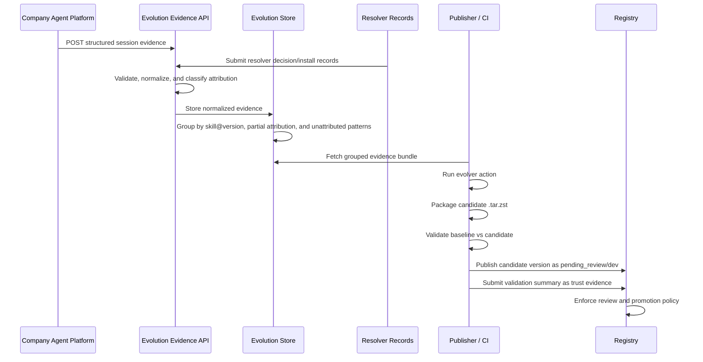

# Collective Skill Evolution Architecture Draft

> Status: draft/future-looking context only.
> This file is not the current source of truth for the live registry contract.
> Use [`../architecture/server-resolver-boundary.md`](../architecture/server-resolver-boundary.md),
> [`../reference/api-contract.md`](../reference/api-contract.md), and
> [`../reference/schema.md`](../reference/schema.md) for the live baseline.

This draft adapts the core idea from SkillClaw-style collective skill
evolution to Aptitude.

The useful idea is not "let an LLM edit skills". The useful system loop is:

```text
company session evidence -> grouped skill evidence -> conservative candidate mutation -> validation -> controlled deployment
```

Aptitude should adopt that loop only through its existing product boundaries:

- the company agent platform feeds already-structured session summaries,
  traces, or trajectories into an evolution evidence endpoint
- `aptitude-resolver` contributes decision/install records that explain why
  exact skills were selected, locked, and installed
- `aptitude-publisher` owns the evolver harness, candidate packaging,
  validation, and candidate publication
- `Aptitude Registry` stores immutable candidate versions, lifecycle state,
  governance state, and validation or trust evidence
- a separate evolution store keeps durable redacted session evidence and grouped
  evolution workspaces

The registry must not become an agent runtime, telemetry warehouse, raw session
store, or autonomous skill editor.

## 1. Recommendation

Use a governed evolution loop fed by company-owned structured session data.

The first version should not ask the resolver to become a session recorder. The
resolver does not run agent tasks, observe tool usage, or know whether a skill
helped the user. It only resolves, locks, and installs skills. Its records are
valuable as provenance, but they are not sufficient skill-effectiveness
evidence.

Recommended posture:

- ingest company session summaries, structured traces, and structured
  trajectories through an evolution evidence endpoint
- use resolver decision/install records only as attribution and provenance
  inputs
- normalize incoming company data into Aptitude evidence records
- group evidence outside the registry
- generate candidate skill versions offline through publisher-controlled jobs
- validate candidate versions against baselines before promotion
- publish evolved skills as new immutable `.tar.zst` versions
- expose them through existing registry governance only after review and
  namespace-specific promotion
- keep lockfiles pinned to exact versions so evolution never breaks replay

Critical rule:

> Evolved skills are new immutable versions. They never rewrite an existing
> `skill@version`.

## 2. Architecture Decisions

| Decision | Choice | Reason |
| --- | --- | --- |
| Evolution posture | Governed loop | Preserves enterprise trust while still allowing collective improvement. |
| Primary evidence source | Company structured session data | The company agent platform can observe runtime skill usage and outcomes; resolver cannot. |
| Resolver evidence role | Supporting decision/install provenance | Resolver records explain selection, policy filtering, dependency solving, locking, and install state. |
| Evidence ingestion | Evolution evidence endpoint | Gives the company platform a stable write contract for summaries, traces, and trajectory-derived records. |
| Evidence storage | Separate evolution store | Prevents registry scope creep into telemetry and runtime trace storage. |
| Promotion model | Namespace-gated `dev -> staging -> prod` | Matches current registry governance vocabulary and avoids global accidental rollout. |
| Validation owner | Publisher/CI validator | Keeps execution and replay outside the registry. |
| Registry role | Immutable catalog and governance ledger | Aligns with the current data-local registry boundary. |
| Publisher role | Evolve, package, validate, publish | Keeps authoring and quality gates on the publishing side. |

## 3. Aptitude Fit

The current Aptitude boundary is:

```text
Publisher enforces -> Registry stores -> Resolver decides
```

Collective evolution should preserve that boundary.

```mermaid
flowchart LR
    Company["Company Agent Platform<br/>session summaries / traces / trajectories"]
    Ingestion["Evolution Evidence API<br/>normalize + validate + redact"]
    EvolutionStore["Evolution Store<br/>evidence + grouping + retention"]
    Resolver["Resolver<br/>decision/install records"]
    Publisher["Publisher / CI<br/>evolver + validator + packaging"]
    Registry["Registry<br/>immutable versions + governance + trust evidence"]
    Consumer["Resolver / Agent<br/>policy-aware install + lock replay"]

    Company -->|structured session evidence| Ingestion
    Resolver -->|selection + lock + install provenance| Ingestion
    Ingestion --> EvolutionStore
    EvolutionStore -->|grouped evidence by skill@version| Publisher
    Publisher -->|candidate .tar.zst + metadata| Registry
    Publisher -->|validation summary / trust evidence| Registry
    Registry -->|promoted immutable versions| Consumer
    Consumer -->|exact fetch + lock pinning| Registry
```



### Company Agent Platform

The company agent platform is the correct owner of runtime session evidence
because it can observe what the resolver cannot:

- user task intent after host-level summarization
- which skills were exposed, read, injected, or invoked
- agent actions and tool-call outcomes
- tool error classes
- final status or success signal
- human feedback or evaluator score
- host/session identifiers

The platform should not send raw logs blindly. It should send structured,
redacted evidence through an ingestion endpoint.

### Evolution Evidence API

The evolution evidence endpoint is the write boundary for company session data.

Recommended first route shape:

```text
POST /evolution/session-evidence
```

This route belongs to the evolution store or a future control-plane service, not
the public resolver-facing registry contract.

The endpoint should:

- authenticate the company evidence producer
- validate a versioned evidence schema
- reject records missing redaction metadata
- accept batch ingestion
- normalize host-specific fields into Aptitude's evidence model
- classify records as attributed, partially attributed, or unattributed
- store raw-enough structured evidence for evolution while avoiding raw prompts,
  secrets, file contents, and full tool outputs by default

The endpoint should not:

- publish skills
- mutate registry versions
- promote candidates
- run the evolver
- expose raw session evidence to resolvers

### Resolver

Resolver is not the runtime session recorder.

Resolver should contribute:

- `resolver_session_id`
- selected root coordinate
- installed coordinates
- lockfile digest
- candidate count and ranking summary
- policy rejection summary
- dependency graph and install order summary
- materialization success or failure

This data helps attribute company sessions back to exact `skill@version`
coordinates and resolver decisions. It does not prove that a skill helped during
agent execution.

Resolver should not own:

- company session ingestion
- runtime tool-call observation
- human outcome scoring
- centralized grouping across users
- candidate skill mutation
- registry promotion state

### Publisher

Publisher is the right place for evolution because candidate creation is an
authoring and release workflow.

Publisher should own:

- evolver prompts and harnesses
- grouped evidence bundle ingestion
- conservative skill edits
- new-skill creation from unattributed or no-skill evidence groups
- candidate `.tar.zst` packaging
- baseline-vs-candidate validation
- publish requests for candidate versions
- validation evidence submission

Publisher should not own:

- long-term registry catalog state
- resolver final selection
- mutable overwrite of existing versions

### Registry

Registry should stay boring. It stores facts and enforces governance.

Registry should own:

- immutable candidate version storage
- lifecycle state
- `review_state`
- `promotion_channel`
- `policy_pack_slug`
- trust evidence references and validation summaries
- visibility enforcement for discovery, exact fetch, and resolution

Registry should not own:

- company session traces
- evolution evidence ingestion
- evolver execution
- replay validation environments
- prompt interpretation
- final selection
- dependency solving

### Evolution Store

The evolution store is a separate bounded context for evidence.

It should own:

- durable normalized evidence records
- evidence ingestion endpoint state
- grouping by `skill@version`
- unattributed groups for missing capability discovery
- resolver-provenance joins
- evidence retention policy
- tenant or namespace contribution controls
- export of grouped evidence bundles to publisher/CI

It should not be treated as the canonical skill catalog.

## 4. Evidence Ingestion Model

The company platform may already gather session summaries, traces, and
trajectories. Aptitude should consume those through a normalized endpoint rather
than inventing a resolver-side session recorder.

Recommended first-version request:

```json
{
  "schema_version": "company-session-evidence.v1",
  "producer": {
    "system": "company-agent-platform",
    "environment": "prod",
    "tenant": "acme"
  },
  "records": [
    {
      "agent_session_id": "agent-session-01HXAMPLE",
      "resolver_session_id": "resolver-session-01HXAMPLE",
      "lockfile_digest": "sha256:0f1e...",
      "skill_coordinates": [
        {"slug": "python.lint", "version": "1.2.3"}
      ],
      "skills_used": [
        {
          "slug": "python.lint",
          "version": "1.2.3",
          "usage": "read"
        }
      ],
      "task_intent_summary": "User wanted to lint and format a Python project.",
      "trajectory_summary": "Agent selected the installed linting skill, ran the documented lint command, hit a cache-directory error, then recovered after adding repo-local cache configuration.",
      "tool_error_classes": ["command_failed", "missing_file"],
      "outcome": "completed",
      "outcome_score": 0.72,
      "human_feedback_summary": "User accepted the final result after one correction.",
      "evaluator_rationale": "The skill helped with command ordering but omitted repo-specific cache guidance.",
      "redaction": {
        "redaction_version": "company-redaction.v1",
        "raw_prompt_included": false,
        "raw_tool_outputs_included": false,
        "file_contents_included": false
      }
    }
  ]
}
```

Required endpoint behavior:

- reject requests without `schema_version`
- reject records without redaction metadata
- reject records that claim raw prompts, raw tool outputs, or file contents are
  included unless an explicit enterprise policy permits that source
- accept records without `resolver_session_id`, but mark them `partially_attributed`
  or `unattributed`
- accept records without `skill_coordinates`, but use them only for missing-skill
  discovery until attribution is improved
- preserve exact `skill@version` when available
- store the normalized record, not host-specific log payloads

Required redaction rules:

- do not store raw prompts by default
- do not store file contents
- do not store full tool outputs
- do not store secrets, tokens, credentials, or environment values
- do not store private workspace payloads
- do not store absolute local paths unless explicit policy allows it
- summarize failure classes instead of copying raw trace payloads

## 5. Resolver Record Join

Resolver data is still useful. It just has a narrower role.

Resolver decision/install records can add:

- whether a skill was selected automatically or explicitly
- which candidates were rejected by policy
- why the winning candidate beat the runner-up
- which exact dependencies were installed
- which lockfile digest was generated
- whether materialization succeeded
- which skill versions were available to the agent host

Join keys should be attempted in this order:

1. `resolver_session_id`
2. `lockfile_digest`
3. exact `skill_coordinates`
4. host-provided install manifest reference

If no join succeeds, the company session evidence remains useful, but its
allowed uses are narrower:

- no-skill or missing-skill discovery
- workflow gap detection
- general failure-mode analysis

It should not drive targeted edits to a specific existing `skill@version`.

## 6. Evidence Grouping

The evolution store should group normalized records by attribution quality.

Attributed groups:

- exact `skill@version`
- enough session summaries to compare success and failure patterns
- eligible for `refine` and `optimize_description`

Partially attributed groups:

- known skill slug but missing exact version, or known lockfile without clear
  use evidence
- eligible for metadata review, resolver-policy review, or attribution
  improvement work
- not enough for body edits unless later evidence resolves attribution

Unattributed groups:

- no exact skill coordinate
- no resolver join
- useful for missing capability discovery
- eligible for `create`, not targeted edits

Minimum useful grouped output:

```json
{
  "group_key": "python.lint@1.2.3",
  "attribution": "attributed",
  "summary_count": 18,
  "success_count": 11,
  "failure_count": 7,
  "common_tool_error_classes": ["command_failed", "missing_file"],
  "common_rationales": [
    "Skill helped with command ordering but omitted repo-local cache guidance."
  ],
  "candidate_action_hint": "refine"
}
```

## 7. Evolution Workflow

The evolution workflow should be batch-oriented at first.



Allowed evolver actions:

| Action | Evidence requirement | Meaning | Registry result |
| --- | --- | --- | --- |
| `refine` | Attributed `skill@version` group | Update an existing skill based on repeated evidence-backed failure or missing guidance. | New immutable version of the existing skill. |
| `create` | Unattributed or no-skill group with repeated reusable procedure | Create a new skill when no existing skill covers the pattern. | New immutable skill identity and first version. |
| `optimize_description` | Attributed or partially attributed group with matching/ranking evidence | Change matching text when the skill body is correct but discovery/triggering is wrong. | New immutable version with metadata/body changes as needed. |
| `skip` | Weak, ambiguous, unsafe, or non-actionable evidence | Leave the catalog unchanged. | No publish. |

Conservative editing rules:

- preserve sections supported by successful sessions
- change only evidence-backed failure points
- prefer targeted edits over rewrites
- keep concrete API details, commands, ports, filenames, and paths when evidence
  does not prove them wrong
- prefer `skip` over speculative edits
- never mutate an existing published version

## 8. Validation Rules

Candidate validation is the control point that keeps this architecture from
becoming skill drift automation.

Baseline and candidate must be evaluated against the same task fixture,
environment contract, and policy profile.

Acceptance rules:

- candidate beats or matches baseline task success
- candidate does not regress stability
- candidate does not regress policy compliance
- candidate does not regress `security_score`
- candidate preserves lockfile reproducibility
- candidate does not introduce forbidden dependencies or visibility violations
- candidate has a validation summary attached before promotion beyond `dev`

Rejected candidates:

- are retained as candidate/evolution evidence
- are not promoted to `prod`
- do not become resolver defaults
- may inform future evolver runs, but cannot override the current best version

Auto-promotion:

- must not exist in the first version
- may be introduced later only through explicit policy-pack rules
- must remain namespace-scoped

## 9. Registry Contract Impact

The first implementation should avoid public resolver-facing API changes.

Prefer existing registry governance fields:

- `review_state`
- `promotion_channel`
- `trust_tier`
- `policy_pack_slug`
- `trust_evidence`

Initial candidate publish posture:

```text
artifact_origin = imported or internal
review_state = pending_review
promotion_channel = dev
trust_tier = untrusted or internal
```

Promotion to `staging` or `prod` should happen only after validation evidence is
attached and policy allows the transition.

If the existing trust-evidence model is not enough later, add an admin-only
evolution evidence reference. That reference should point to validation
summaries or evidence bundle digests, not raw company session data.

Do not add to the registry:

- a public `POST /evolve` route
- a resolver-facing raw evidence read route
- company-session evidence ingestion
- server-side candidate solving
- registry-owned validation execution
- registry-owned LLM calls

Discovery remains candidate generation. Resolution remains direct authored
`depends_on` reads. Exact fetch remains immutable coordinate fetch.

## 10. Resolver Consumption

Resolver must remain deterministic even while the catalog evolves.

Required resolver behavior:

- discovery may see promoted evolved versions only when local policy allows the
  namespace, promotion channel, trust tier, and review state
- final selection remains resolver-owned
- lockfiles pin exact evolved versions
- lock replay uses pinned coordinates even when newer evolved versions exist
- resolver can emit decision/install records for attribution
- resolver does not record agent runtime sessions

Resolver ranking may later use evolution-derived facts such as validation score,
accepted-candidate count, or regression rate, but those are ranking inputs only.
They must not override policy eligibility.

## 11. Risks And Controls

| Risk | Failure mode | Control |
| --- | --- | --- |
| Company data overreach | The endpoint becomes a raw log sink for prompts, files, and tool outputs. | Versioned schema, redaction metadata, default rejection of raw payload claims, and retention policy. |
| False attribution | Session evidence is attached to the wrong `skill@version`. | Join through resolver session id, lockfile digest, exact coordinates, and attribution-quality labels. |
| Skill drift | Evolver rewrites useful guidance based on narrow failures. | Conservative edits, baseline comparison, review state, and promotion gates. |
| Validation overfitting | Candidate improves replay fixtures but fails real use. | Use diverse fixtures, holdout tasks, and post-promotion regression metrics. |
| Registry scope creep | Registry becomes evidence store, evolver, or validator. | Keep evidence endpoint and store outside the registry. |
| Resolver nondeterminism | New evolved version changes replay behavior. | Exact lockfile pinning and replay tests. |
| Enterprise trust failure | Candidate auto-promotes across tenants or namespaces. | Namespace-gated promotion and no first-version auto-promotion. |
| Search pollution | Low-quality evolved descriptions improve matching but reduce actual task success. | Validate description-only changes and keep resolver final selection local. |

## 12. Phased Roadmap

### Phase 1: Company summary ingestion MVP

Goal: prove that existing company session summaries are good enough to drive
safe evolution decisions.

- add `POST /evolution/session-evidence` to the evolution store or future
  control-plane service
- ingest company-owned structured summaries, traces, or trajectory-derived
  records
- validate schema and redaction metadata
- classify records as attributed, partially attributed, or unattributed
- ingest resolver decision/install records as optional provenance
- export grouped evidence bundles to publisher/CI

Exit criteria:

- endpoint rejects records without redaction metadata
- endpoint rejects raw prompt/tool/file payload claims by default
- attributed records preserve exact `skill@version`
- unattributed records can still form missing-skill groups

### Phase 2: Offline evolution from grouped evidence

Goal: generate candidate skill changes from company evidence without changing
registry behavior.

- publisher consumes grouped evidence bundles
- publisher runs evolver actions
- publisher packages candidate `.tar.zst` artifacts
- validation runs in CI or local controlled environments
- candidate publish uses current registry publish and governance surfaces

Exit criteria:

- candidate generation never mutates existing published versions
- `refine` requires attributed evidence
- `create` can use unattributed repeated patterns
- at least one candidate can be validated and published as `pending_review` /
  `dev`

### Phase 3: Validation and registry promotion

Goal: make validation evidence part of the governance workflow.

- publisher/CI compares baseline and candidate against the same fixture
- registry stores candidate versions under `pending_review` / `dev`
- validation summaries are attached as trust evidence or admin evidence
  references
- promotion to `staging` or `prod` requires validation evidence

Exit criteria:

- unapproved candidates remain hidden from normal resolver reads
- accepted candidates can be promoted by namespace policy
- rejected candidates do not become resolver defaults

### Phase 4: Governed collective evolution

Goal: make evolution a controlled platform capability.

- namespace policy controls which company evidence producers may contribute
- namespace policy controls which promoted versions consumers may install
- policy packs may allow constrained auto-promotion
- dashboards expose candidate acceptance, rejection, validation deltas, and
  post-promotion regressions
- resolver can optionally use validation-derived ranking signals after policy
  filtering

Exit criteria:

- auto-promotion, if enabled, is namespace-scoped and policy-pack controlled
- lock replay remains deterministic across catalog changes
- regression metrics are monitored after promotion

## 13. Test And Evaluation Plan

Evidence endpoint tests:

- requests without `schema_version` are rejected
- records without redaction metadata are rejected
- default policy rejects records claiming raw prompts, raw tool outputs, or file
  contents
- batch ingestion is deterministic
- host-specific fields normalize into the Aptitude evidence model
- attribution status is assigned consistently

Resolver join tests:

- evidence joins by `resolver_session_id`
- evidence joins by `lockfile_digest`
- exact `skill@version` is preserved when present
- records without a join are marked `unattributed`
- unattributed records cannot drive targeted edits to existing skills

Evidence grouping tests:

- attributed sessions are grouped by each referenced `skill@version`
- partially attributed sessions are grouped separately
- unattributed sessions form missing-skill groups
- grouping preserves baseline coordinates when available
- aggregate counts are deterministic

Publisher and candidate tests:

- `refine` requires attributed evidence and produces a new version
- `create` creates a new skill only from reusable unattributed or no-skill
  evidence
- `optimize_description` is validated like body changes
- `skip` produces no publishable artifact
- candidate bundles are valid `.tar.zst` skill artifacts

Validation tests:

- baseline and candidate run against the same fixture
- score delta is computed from comparable runs
- stability, policy compliance, and security checks are part of the decision
- rejected candidates cannot promote to `prod`

Registry contract tests:

- candidate publish can use existing immutable publish semantics
- `pending_review` / `dev` candidates are hidden from production readers
- trust evidence can attach validation summaries without rewriting artifact
  bytes
- discovery still returns candidate slugs only
- resolution still returns direct authored `depends_on` only

Resolver tests:

- lock replay uses pinned exact versions after newer evolved versions exist
- resolver decision/install records can be emitted without recording runtime
  agent sessions
- promoted evolved versions are considered only after policy filtering

Evaluation metrics:

- accepted candidate rate
- rejected candidate rate
- attribution rate
- unattributed evidence rate
- validation score delta
- downstream resolver success delta
- tool-error rate delta
- post-promotion regression rate
- evidence ingestion rejection rate

## 14. Open Questions

These should be answered before implementation, not during the first schema
change:

- What exact structured session format does the company already gather?
- Does that format include exact `skill@version`, lockfile digest, or resolver
  session id?
- Which fields are already redacted, and which redaction guarantees are
  enforceable at ingestion time?
- Should `POST /evolution/session-evidence` live in a standalone evolution
  service, an enterprise control-plane service, or an object-storage-backed
  ingestion job with an API facade?
- Which validation fixtures are authoritative enough to gate promotion?
- How should version numbers encode evolved candidates: normal semver bumps,
  prerelease identifiers, or promotion-channel metadata only?
- Which trust-evidence fields are sufficient for validation summaries, and
  when would an admin-only evolution evidence reference become necessary?

## 15. Critical Recommendation

Do not start by making the resolver record agent sessions.

That would be architecturally dishonest. Resolver can explain why a skill was
selected, locked, and installed. It cannot observe whether an agent used the
skill correctly or whether the skill solved the user's task.

Start with the company session summaries, traces, and trajectory-derived records
that already exist. Feed them through a versioned evidence endpoint, normalize
them, classify attribution quality, and use resolver records only to strengthen
the join to exact installed versions.

Delay registry schema changes until existing governance and trust-evidence
fields prove insufficient.
