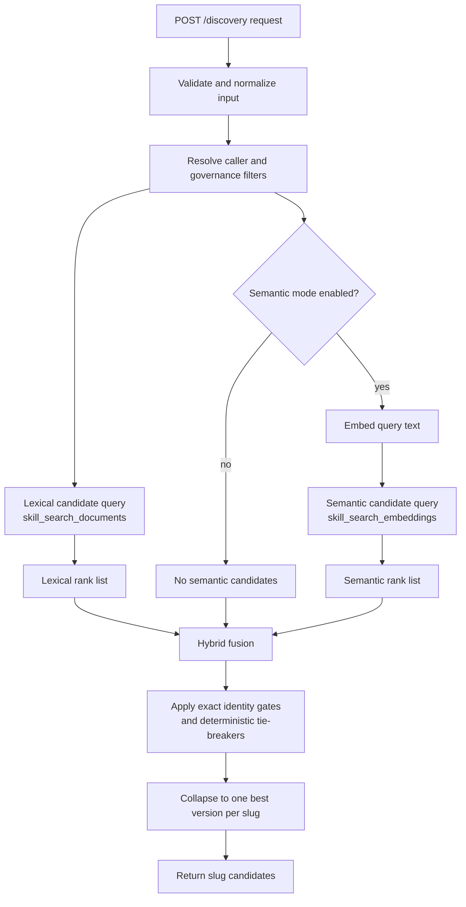

# Discovery and Search Mechanism Review

## Purpose
This document consolidates how `Aptitude Registry` discovery works today and
how Plan 18 should extend it with OpenAI-backed description/tag semantic search.
It is a review and planning document, not a claim that Plan 18 is already live.

Primary sources reviewed:

- PostgreSQL full text search introduction:
  <https://www.postgresql.org/docs/current/textsearch-intro.html>
- pgvector-python repository:
  <https://github.com/pgvector/pgvector-python>
- pgvector-python RRF hybrid example:
  <https://github.com/pgvector/pgvector-python/blob/master/examples/hybrid_search/rrf.py>
- pgvector-python cross-encoder hybrid example:
  <https://github.com/pgvector/pgvector-python/blob/master/examples/hybrid_search/cross_encoder.py>
- Plan 18:
  [`../../.agents/plans/18-openai-description-tag-semantic-discovery.md`](../../.agents/plans/18-openai-description-tag-semantic-discovery.md)
- Current canonical architecture:
  [`../architecture/discovery-and-ranking.md`](../architecture/discovery-and-ranking.md)

## Boundary
`POST /discovery` is candidate generation. It returns ordered skill slugs. It
does not choose the final skill, solve dependency closures, generate lockfiles,
or plan execution. Resolver-side components can rerank, prune, or make final
choices using runtime/task context.

Governance is applied before relevance. Lifecycle, trust, namespace, promotion,
review, policy, and tag filters define the eligible candidate universe. Lexical
rank, semantic rank, and co-usage signals can only order eligible candidates.

## Current Mechanism

### Request Input
Discovery accepts:

- `query`: required free-text search input
- `tags`: optional, normalized and used as structured filters
- `context_skills`: optional list of at most 50 exact `{slug, version}`
  coordinates, used only for bounded co-usage boosts

The request trims and validates `query`, normalizes each context coordinate,
and removes duplicate coordinates in first-seen order. `name` and `description`
are not accepted discovery fields. The normalized query is used for lexical and
semantic retrieval.

### Lexical Search
The lexical read model is `skill_search_documents`. It stores one derived row
per immutable skill version and includes a `search_vector` column.

The searchable full-text document is built from:

- slug
- name
- description
- tags

PostgreSQL full text search treats the `tsvector` as the preprocessed searchable
document. The query side uses a `tsquery`, currently through
`plainto_tsquery('simple', :query_text)`. Matching uses `@@`, and ranking uses
`ts_rank_cd`.

This path owns:

- exact slug match
- exact name match
- slug/name substring fallback
- metadata full-text matching
- tag containment filtering
- per-version ranking before slug collapse

The current use of the `simple` text search configuration is conservative. It
lowercases and tokenizes but does not provide language-specific stemming,
synonym expansion, typo tolerance, or semantic meaning.

### Per-Slug Collapse
Discovery stores version-aware search rows but returns slug candidates. The
repository ranks versions within each slug and keeps the best version before
returning candidates. This keeps public responses stable while preserving
version-aware eligibility and ranking internally.

## Planned Plan 18 Semantic Mechanism

### Semantic Source
Plan 18 narrows semantic embeddings to description and tags only.

Indexed skill semantic source:

```text
normalize(description) + " " + normalize(tags...)
```

Query semantic source:

```text
normalize(request.query)
```

The stored semantic index remains description/tag-only. Slug and name stay
lexical identity signals; tags remain structured filters. The request query is
the runtime semantic input.

### Vector Store
Plan 18 keeps vectors in `skill_search_embeddings`, a derived read model keyed
by skill version and embedding index key. The proposed Plan 18 index key is:

```text
openai:text-embedding-3-small:description-tags-v1
```

The provider model name remains `text-embedding-3-small`; the index key includes
provider, model, and source-version semantics so older slug/name-based rows
cannot be mixed into the new search behavior.

Vectors remain `halfvec(1536)` with HNSW cosine indexing. Query vectors must be
cast explicitly to `halfvec(1536)`, and the query operator must match the index
operator class.

### Hybrid Retrieval
Hybrid search should use two bounded candidate generators:

- lexical candidate list ordered by exact-match gates and `ts_rank_cd`
- semantic candidate list ordered by vector distance

The pgvector-python RRF example demonstrates the right architecture shape:
produce a semantic rank list, produce a keyword rank list, join by document id,
and compute a fused score from rank positions. Plan 18 should adapt this pattern
to registry entities and governance filters.

Recommended fusion:

```text
rrf_score =
  coalesce(1 / (60 + lexical_rank), 0) +
  coalesce(1 / (60 + semantic_rank), 0)
```

Registry ordering still keeps exact slug and exact name matches ahead of
ordinary fused relevance. After exact identity gates, RRF should be used as the
hybrid relevance score, followed by deterministic tie-breakers.

Raw vector distance and raw `ts_rank_cd` are not comparable scales. They should
not be directly added or compared.

### Cross-Encoder Review
The pgvector-python cross-encoder example retrieves semantic and keyword
results, deduplicates them, and reranks result text with a cross-encoder. That
is useful as a general hybrid-search pattern, but it is not a good registry
request-path default.

For `Aptitude Registry`, cross-encoder reranking should stay out of Plan 18
runtime behavior because:

- it adds a second model dependency after the embedding provider
- it increases request latency and failure modes
- it requires text pairs that may drift from the slug-only public contract
- resolver-side reranking is the better place for task-specific final choice

Cross-encoder reranking can be considered later for offline evaluation or
resolver-side ranking experiments.

## Consolidated Flow



## PostgreSQL and pgvector Rules

- Keep `search_vector` as the lexical full-text document.
- Keep GIN indexing for full-text search.
- Keep lexical query construction explicit; avoid relying on implicit text
  search configuration.
- Use `plainto_tsquery` for simple user text until phrase or web-style syntax is
  deliberately designed.
- Keep `halfvec(1536)` for semantic vectors unless model dimensions change.
- Use HNSW with cosine ops for vector candidate generation.
- Use `SET LOCAL hnsw.ef_search` inside the semantic query transaction.
- Keep governance and structured filters in SQL for both lexical and semantic
  candidate generators.
- Prefer RRF rank fusion over raw score arithmetic.
- Do not weaken tag filters to improve vector recall.

## Neon Notes
Neon supports pgvector, so a separate vector database is not required for Plan
18. Runtime app reads can use the normal application database URL policy, but
extension creation, migrations, and index maintenance need a direct connection
when PgBouncer pooling would be unsafe.

For hosted rollout:

- verify the production Neon Postgres version and pgvector extension version
- run extension and migration work through direct migration connection settings
- keep Render Workflow indexing batches small enough for Neon connection and
  OpenAI rate limits
- monitor index size, query latency, and failed indexing rows before enabling
  hybrid mode

## Recommended Documentation Outcome
When Plan 18 is implemented, promote the stable parts of this review into
`docs/architecture/discovery-and-ranking.md`:

- lexical search remains slug/name/description/tag full-text search
- semantic index sources are description/tag-only, with the request query used at runtime
- tags remain hard filters
- hybrid fusion uses rank positions, preferably RRF
- cross-encoder reranking is not registry request-path behavior
- discovery remains slug-only candidate generation
