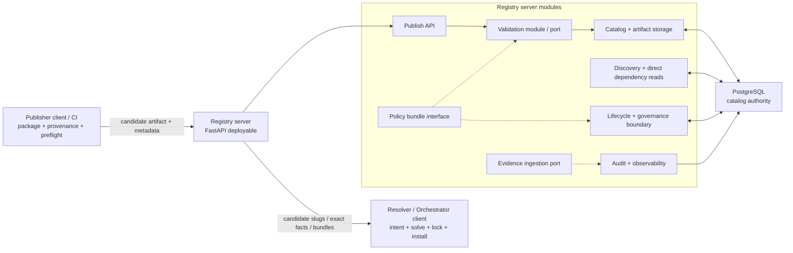
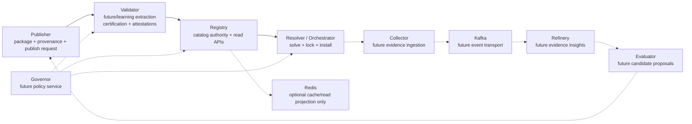

# Aptitude Modular System Architecture Draft

> Status: draft/future-looking context only.
> This file is not the current source of truth for the live registry contract.
> Use [`../architecture/server-resolver-boundary.md`](../architecture/server-resolver-boundary.md),
> [`../reference/api-contract.md`](../reference/api-contract.md), and
> [`collective-skill-evolution.md`](collective-skill-evolution.md) for the
> current boundary and evolution context.

This draft describes the recommended system shape for Aptitude before any
large-scale service extraction:

```text
one modular Registry server
+ modular publisher / resolver / orchestrator clients
+ clear module contracts
+ explicit future extraction path
```

The goal is to keep the system simple enough to build and operate while still
learning and applying microservice methodology: bounded contexts, explicit
contracts, ownership rules, failure behavior, deployment seams, and extraction
triggers.

## 1. Core Recommendation

Do not start by splitting Aptitude into many standalone services. Start by
splitting it into modules with service-grade boundaries.

Default runtime:

- `Registry` is the only deployable server.
- PostgreSQL remains the authoritative store.
- `Publisher` is a CLI/CI/client workflow that packages and submits artifacts.
- `Resolver` stays client-side and owns prompt-sensitive selection, solving,
  lock generation, and install planning.
- `Orchestrator` is the system-level name for resolver runtime responsibilities;
  it is not a second server by default.
- `Validator`, `Governor`, `Collector`, `Refinery`, and `Evaluator` are modules,
  interfaces, planned ports, or offline workflows until extraction is justified.

The long-term supply-chain boundary still matters:

```text
Publisher prepares -> Validator certifies -> Registry stores -> Resolver/Orchestrator consumes
```

Do not collapse those responsibilities just because they share a process early.
The right architecture is **modular first, distributed later**.

## 2. Baseline Runtime Shape



Baseline rules:

- Registry owns data-local work: immutable publish, discovery candidate
  generation, direct dependency reads, exact metadata/content fetch, lifecycle
  governance, provenance capture, and boundary audit.
- Resolver/Orchestrator owns decision-local work: prompt interpretation,
  request construction, reranking, final selection, dependency solving, locks,
  replay, and execution planning.
- Publisher owns artifact preparation: package layout, provenance, local
  preflight checks, author input, and publish submission.
- Validation is a separate module boundary, even if it starts in the same
  process.
- Policy is accessed through a bundle interface before `Governor` exists as a
  service.
- Evidence ingestion is a documented port before `Collector` or `Refinery`
  exists as a service.

## 3. Module Boundaries

| Module / Boundary | Lives in baseline | Owns | Must not own |
| --- | --- | --- | --- |
| `Publisher` | Client / CI workflow | Packaging, provenance input, local preflight, publish request submission. | Registry persistence, lifecycle state, final runtime selection. |
| `Publish API` | Registry server | Authenticated publish entrypoint, request validation, handoff to validation/catalog modules. | Long-running certification policy, resolver decisions. |
| `Validator` | Registry module / worker / port | Artifact validation, policy-gated checks, reproducibility checks, validation attestations. | Runtime install decisions, catalog ownership, evidence mining. |
| `Catalog` | Registry server | Immutable versions, artifact bytes/digests, metadata, relationships, discovery projections. | Prompt interpretation, solved dependency plans. |
| `Lifecycle / Governance` | Registry server | Lifecycle state, namespace visibility, service-token access, route-level governance. | Central enterprise policy authoring. |
| `Policy bundle interface` | Registry module, static files, or DB-backed config | Effective policy lookup, `policy_bundle_id`, `policy_digest`, fail-closed behavior. | Becoming a synchronous remote dependency before needed. |
| `Resolver / Orchestrator` | Client / CLI / SDK | Intent interpretation, candidate pruning, solving, lock generation, install planning, local integrity verification. | Artifact certification, catalog persistence. |
| `Evidence ingestion port` | Registry module or offline input | Optional decision/install records and future session-evidence shape. | Durable analytics, candidate generation. |
| `Collector` | Future extraction | Redaction, normalization, ingestion audit, replay markers. | Evidence insights, skill edits. |
| `Refinery` | Future extraction | Evidence storage, attribution, trend/failure aggregation, insight bundles. | Candidate editing, validation authority. |
| `Evaluator` | Future extraction or offline workflow | Candidate artifact proposals from evidence. | Direct publish, lifecycle promotion, validation attestation. |
| `Governor` | Future extraction | Central policy authoring, signed bundles, policy explanations, tenant/namespace rules. | Catalog storage, solving, evidence aggregation. |

## 4. Microservice Learning Track

The distributed path should stay in the plan, but as a controlled extraction
track rather than the default runtime.

Best first extraction candidate: `Validator`.

Why `Validator` first:

- It has a clear input/output contract.
- It is naturally isolated from resolver decisions.
- It can teach service contracts, health checks, auth, request IDs, logging,
  timeouts, retries, and failure handling without requiring Kafka or multiple
  databases.
- It strengthens the supply-chain boundary instead of creating arbitrary
  distribution.

Learning topology:

```text
Publisher client / CI
-> Validator service
-> Registry service
-> Resolver / Orchestrator client
```

Constraints for this track:

- Start with HTTP/JSON, not gRPC.
- Keep artifact bytes on HTTP upload/fetch paths or digest-addressed storage.
- Use Docker Compose for local service practice.
- Define explicit validation request/response models and attestation shape.
- Registry stores accepted artifacts and attestations; Validator does not own
  the catalog.
- If the service is down, Registry must fail closed for governed namespaces.

This gives real microservice practice without turning every future concept into
a running service.

## 5. Future Extraction View

The target topology remains useful as a map of possible extraction boundaries.
It is not the baseline deployment.



Future infrastructure remains optional:

- `Redis` is cache/read projection only. PostgreSQL remains authoritative.
- `Kafka` is transport/replay infrastructure only. Durable product data belongs
  in service stores.
- `Governor` is extracted only when multiple modules/services need centrally
  versioned policy bundles and explanations.
- `Collector`, `Refinery`, and `Evaluator` are extracted only when evidence
  ingestion and candidate generation become real workflows.

## 6. Extraction Triggers

| Boundary | Extract when | Keep modular when |
| --- | --- | --- |
| `Validator` | Validation jobs are slow, security-owned, independently released, or useful as the first microservice learning target. | Validation is still fast, local, and owned by the same development flow. |
| `Governor` | Multiple services need centrally versioned policy bundles, delegated grants, and policy explanations. | One server and clients can use static/cached policy bundles. |
| `Collector` | Session/evidence ingestion has separate privacy, redaction, replay, or retention needs. | Evidence is optional, offline, or low-volume. |
| `Refinery` | Evidence aggregation needs its own storage, jobs, and operating model. | Insights can be produced offline or deferred. |
| `Evaluator` | Candidate generation needs isolated model/runtime resources and review workflow. | Suggestions are manual or experimental. |
| `Redis` | Measured read hot paths need cache/read projections with proven invalidation semantics. | PostgreSQL serves the current read load. |
| `Kafka` | Multiple async consumers, replay requirements, ordering constraints, and durable consumer stores exist. | Events are only a naming convention for in-process calls, DB rows, or an outbox. |
| Hosted `Orchestrator` | Multiple clients need shared hosted planning, policy, or lock replay service. | Resolver CLI/SDK can own runtime decisions locally. |

## 7. Protocol Posture

Use the simplest protocol that preserves the boundary.

- Use in-process typed interfaces for baseline modules.
- Use HTTP/JSON for first extracted services because the project is already
  FastAPI-oriented and OpenAPI is easy to inspect, test, and share.
- Defer gRPC until a stable, high-volume internal boundary proves it needs
  generated clients, streaming, or stricter binary contracts.
- Do not move artifact bytes through gRPC. Use multipart upload,
  digest-addressed fetch, or object-storage references.
- Use function calls, database rows, or an outbox before Kafka.

The point is not to avoid distributed systems forever. The point is to avoid
optimizing transport before boundaries, scale, and ownership are real.

## 8. Data Ownership

Logical ownership comes before physical ownership.

| Boundary | Baseline data shape | Extracted data shape |
| --- | --- | --- |
| Registry catalog | PostgreSQL tables owned by registry repositories. | Registry database remains catalog authority. |
| Validation | Registry-adjacent validation rows or attestations. | Validator database for runs/findings; Registry stores accepted attestation references. |
| Policy | Static bundles, config, or registry-adjacent policy tables. | Governor database for policy versions, bundles, grants, and explanations. |
| Resolver / Orchestrator | Local lockfiles and client state. | Hosted service DB only if orchestration becomes a server. |
| Evidence ingestion | Optional registry-adjacent port or offline files. | Collector short-retention store and replay markers. |
| Evidence insights | Deferred/offline. | Refinery evidence/analytics store. |
| Candidate generation | Manual/offline workspace. | Evaluator job store and candidate workspace. |
| Cache | No baseline cache. | Redis stores optional derived read projections only. |
| Events | No baseline broker. | Kafka stores transport/replay events, not product truth. |

Do not share databases between physically extracted services. If a boundary is
not yet extracted, keep the code ownership clear enough that data can move
later without rewriting the whole product.

## 9. Risks And Controls

| Risk | Why it matters | Control |
| --- | --- | --- |
| Module boundaries become cosmetic | A modular monolith can still turn into one tangled server. | Define module APIs, ownership, tests, and allowed dependencies. |
| Registry absorbs resolver logic | The server becomes prompt-sensitive and starts returning solved plans. | Preserve the canonical rule: Registry owns data-local work; Resolver owns decision-local work. |
| Validator logic duplicates | Publisher, Registry, and Resolver each implement their own certification rules. | Validator owns certification; Publisher preflights; Resolver performs local integrity checks only. |
| Distributed path disappears | The project loses the learning value of microservice methodology. | Keep Validator extraction as the first explicit learning track. |
| Distributed path dominates too early | Many services create operational drag before product boundaries are stable. | Extract one boundary at a time, starting with Validator. |
| Redis becomes truth | Stale cache can leak unsafe lifecycle or policy state. | Redis is optional cache only; authoritative reads verify PostgreSQL-backed state. |
| Kafka becomes product storage | Retention/replay semantics get confused with durable evidence. | Service stores own product data; Kafka is transport only. |
| Governor becomes synchronous outage path | Every request can fail when policy service is unavailable. | Use signed/cached policy bundles and fail-closed rules. |
| Evaluator bypasses supply chain | Model-generated edits can reach users without review. | Evaluator submits to Publisher only; Validator and Registry gates remain mandatory. |

## 10. Rollout Strategy

Phase 0: document the modular architecture.

- Rename the draft around modular architecture, not microservices as the
  default.
- Keep the future extraction graph as planning context.
- Make the server/client/module split explicit.

Phase 1: keep the current Registry + Resolver boundary.

- Registry stays the only server.
- Publisher and Resolver/Orchestrator stay clients.
- PostgreSQL remains authoritative.
- Validation becomes a named module/port, not a separate service by default.

Phase 2: strengthen module contracts.

- Define validation request/attestation shapes.
- Define policy bundle lookup as an interface.
- Define optional evidence ingestion as a port.
- Keep route examples non-canonical and linked back to the live API contract.

Phase 3: extract Validator as the first learning service if desired.

- Run Registry and Validator with Docker Compose.
- Use HTTP/JSON and service-token auth.
- Add health checks, request IDs, structured logs, timeouts, and fail-closed
  behavior.
- Keep Registry as catalog authority.

Phase 4: add evidence/evolution modules only when the workflow is real.

- Start with Collector as a port or offline ingestion path.
- Add Refinery when evidence aggregation has a concrete use.
- Add Evaluator only behind Publisher and Validator.

Phase 5: introduce optional infrastructure only after pressure exists.

- Add Redis for measured read hot paths.
- Add Kafka for real async fanout/replay.
- Add Governor when multiple services/modules need centrally versioned policy.

## 11. Resolved Decisions And Open Questions

Resolved:

- The near-term architecture is one modular Registry server plus modular
  Publisher/Resolver/Orchestrator clients.
- The distributed path stays in the plan, but it is an extraction path, not the
  default runtime.
- Validator is the first serious extraction candidate and the best
  microservice-learning target.
- Redis, Kafka, Governor, Collector, Refinery, and Evaluator are not baseline
  requirements.
- gRPC is deferred until a stable, high-volume internal boundary earns it.

Open questions:

- Should Validator remain only a module for now, or become an explicit learning
  service in the next planning milestone?
- Which validation checks are authoritative enough to produce attestations?
- What is the minimum policy-bundle shape needed before Governor exists?
- Which resolver/orchestrator decision records are worth keeping before
  evidence ingestion exists?
- What exact signal would justify Redis, Kafka, or hosted Orchestrator
  extraction?
