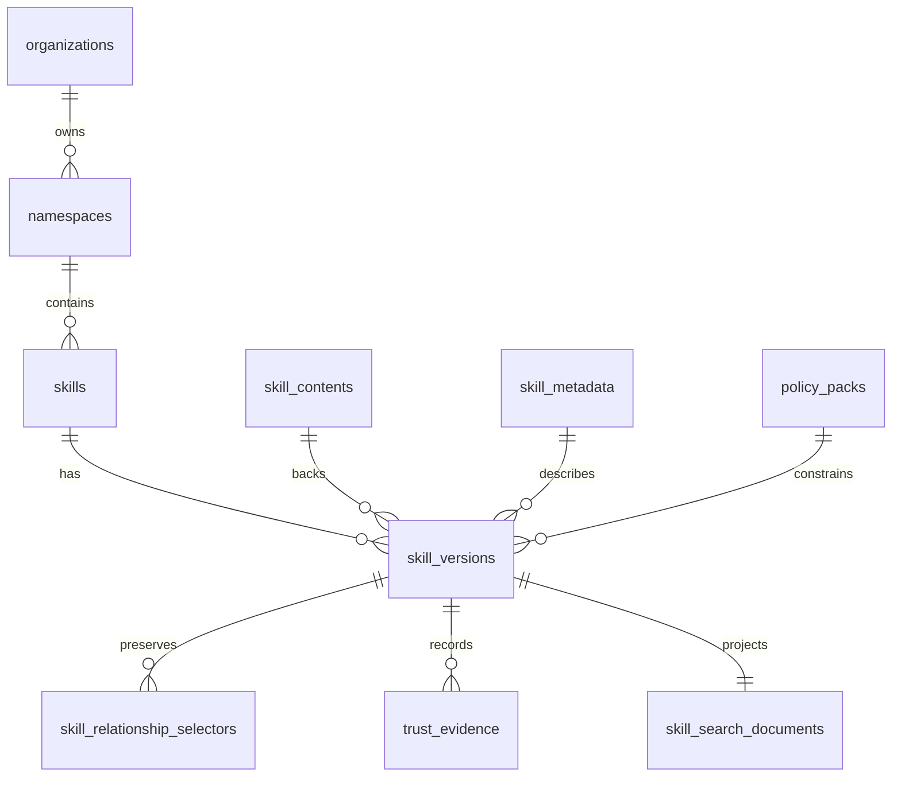

# Database Schema

> Status: canonical PostgreSQL schema baseline for the live registry.
> Use [`api-contract.md`](api-contract.md) for the live HTTP contract.

## Purpose

This document describes the canonical PostgreSQL baseline for the registry data model.

It reflects the current runtime shape created by [`alembic/versions/0001_initial_schema.py`](../../alembic/versions/0001_initial_schema.py) and evolved through [`alembic/versions/0006_embedding_processing_status.py`](../../alembic/versions/0006_embedding_processing_status.py):

- PostgreSQL is the only authoritative store.
- versions are immutable.
- discovery queries stay body-free.
- exact content is stored as digest-deduplicated opaque artifacts.
- identity, versioning, content, metadata, selectors, enterprise workflow state, search projection, and audit records are modeled separately.

## Canonical Baseline

The live schema is centered on immutable version rows, digest-backed bundle rows, authored selector rows, and a derived search projection.

- `organizations` and `namespaces` define enterprise ownership boundaries.
- `skills` stores the logical identity row, namespace ownership, and mutable install aggregate.
- `skill_versions` binds immutable artifact, metadata, publish-time trust/provenance, and mutable workflow fields.
- `skill_contents` stores the canonical `application/zstd` artifact bytes plus digest and size metadata.
- `policy_packs` stores registry-enforced policy-pack references.
- authored selectors live in `skill_relationship_selectors` and remain the only persisted dependency source of truth.
- discovery uses `skill_search_documents` as a derived, governance-aware read model.
- `trust_evidence` is append-only evidence attached to immutable version rows.
- `audit_events` remains the append-only audit sink for registry actions.

Removed compatibility artifacts:

- `skill_dependencies`
- `skill_relationship_edges`
- `skill_version_checksums`
- legacy markdown-only content assumptions

## Design Principles

- Keep `skills` as the stable identity row.
- Keep `skill_versions` immutable after publish.
- Store exact artifacts in `skill_contents.payload` as opaque bytes.
- Reuse identical artifacts through `skill_contents.checksum_digest`.
- Keep high-cardinality filters and ranking fields in typed columns.
- Use `jsonb` only for flexible structured metadata.
- Keep discovery/list/search APIs off the bundle table by default.
- Keep search read models derived and rebuildable.

## Storage Guidance

Use PostgreSQL row storage and TOAST implicitly for artifact payloads.

- `skill_contents.payload` is a `bytea`/`LargeBinary` column.
- do not use Postgres large objects or reconstruct artifacts from normalized rows.
- the main optimization is still query-path separation so metadata-heavy reads never touch artifact bytes unless exact content is requested.

## Entity Overview

`audit_events` is intentionally separate from the skill publication graph.

## Runtime Tables

### `audit_events`

Append-only audit log for registry-side events.

| Column | Type | Constraints | Purpose |
| --- | --- | --- | --- |
| `id` | `integer` | PK | Internal audit event key. |
| `event_type` | `varchar(100)` | `NOT NULL` | Audit event discriminator. |
| `payload` | `json` | nullable | Event-specific structured metadata. |
| `created_at` | `timestamptz` | `NOT NULL`, server default | Event creation timestamp. |

### `organizations`

Enterprise organization owner for one or more namespaces.

| Column | Type | Constraints | Purpose |
| --- | --- | --- | --- |
| `id` | `bigint` | PK | Internal organization key. |
| `slug` | `text` | `NOT NULL`, unique | Stable organization identifier. |
| `display_name` | `text` | `NOT NULL` | Human-readable organization name. |
| `created_at` | `timestamptz` | `NOT NULL`, server default | Row creation time. |
| `updated_at` | `timestamptz` | `NOT NULL`, server default | Last organization update. |

### `namespaces`

Namespace ownership boundary for skill identities.

| Column | Type | Constraints | Purpose |
| --- | --- | --- | --- |
| `id` | `bigint` | PK | Internal namespace key. |
| `organization_fk` | `bigint` | `NOT NULL`, FK -> `organizations.id` | Owning organization. |
| `slug` | `text` | `NOT NULL`, unique | Stable namespace identifier. |
| `visibility` | `text` | `NOT NULL`, check-constrained | `public` or `private`. |
| `created_at` | `timestamptz` | `NOT NULL`, server default | Row creation time. |
| `updated_at` | `timestamptz` | `NOT NULL`, server default | Last namespace update. |

Constraints and indexes:

- B-tree index on `organization_fk`
- check constraint on `visibility`

### `skills`

Stable identity row.

| Column | Type | Constraints | Purpose |
| --- | --- | --- | --- |
| `id` | `bigint` | PK | Internal identity key. |
| `slug` | `text` | `NOT NULL`, unique | Stable public skill identifier. |
| `namespace_fk` | `bigint` | `NOT NULL`, FK -> `namespaces.id` | Owning namespace for grant and visibility checks. |
| `install_count` | `bigint` | `NOT NULL`, default `0` | Mutable aggregate install/download count across all versions of the skill. |
| `created_at` | `timestamptz` | `NOT NULL`, server default | Row creation time. |
| `updated_at` | `timestamptz` | `NOT NULL`, server default | Last identity-state update. |

Constraints and indexes:

- unique index on `slug`
- B-tree index on `namespace_fk`
- no `current_version_id` pointer is stored on this table

### `skill_versions`

Immutable version rows binding identity, content, metadata, publish-time trust/provenance, and mutable enterprise workflow state.

| Column | Type | Constraints | Purpose |
| --- | --- | --- | --- |
| `id` | `bigint` | PK | Internal immutable version key. |
| `skill_fk` | `bigint` | `NOT NULL`, FK -> `skills.id` | Parent skill identity. |
| `version` | `text` | `NOT NULL` | Semantic version string. |
| `content_fk` | `bigint` | `NOT NULL`, FK -> `skill_contents.id` | Immutable artifact row. |
| `metadata_fk` | `bigint` | `NOT NULL`, FK -> `skill_metadata.id` | Immutable metadata row. |
| `checksum_digest` | `varchar(64)` | `NOT NULL` | Version-level digest returned in exact metadata reads. |
| `lifecycle_status` | `text` | `NOT NULL`, default `published` | `published`, `deprecated`, or `archived`. |
| `lifecycle_changed_at` | `timestamptz` | `NOT NULL`, server default | Most recent lifecycle transition time. |
| `trust_tier` | `text` | `NOT NULL`, default `untrusted` | `untrusted`, `internal`, or `verified`. |
| `artifact_origin` | `text` | `NOT NULL`, default `internal` | `internal`, `imported`, `verified`, or `restricted`. |
| `review_state` | `text` | `NOT NULL`, default `approved` | `pending_review`, `approved`, or `rejected`. |
| `promotion_channel` | `text` | `NOT NULL`, default `prod` | `dev`, `staging`, or `prod` enterprise promotion channel. |
| `policy_pack_fk` | `bigint` | nullable, FK -> `policy_packs.id` | Optional policy-pack reference. |
| `provenance_repo_url` | `text` | nullable | Minimal source repository provenance. |
| `provenance_commit_sha` | `text` | nullable | Commit associated with the published version. |
| `provenance_tree_path` | `text` | nullable | Optional repository subpath for the skill. |
| `provenance_publisher_identity` | `text` | nullable | Advisory publisher or CI identity collected at publish time. |
| `policy_profile_at_publish` | `text` | nullable | Server-derived policy profile snapshot for advisory trust context. |
| `created_at` | `timestamptz` | `NOT NULL`, server default | Insert time. |
| `published_at` | `timestamptz` | `NOT NULL`, server default | Publish timestamp. |

Checksum rule:

- `checksum_digest` is derived from the content checksum plus normalized metadata, publish-time trust/provenance inputs, and authored relationships.
- changing artifact bytes, metadata, or authored relationships creates a new immutable version row.
- post-publish workflow changes to lifecycle, namespace ownership, review state, promotion channel, trust tier, policy pack, or trust evidence do not recompute `checksum_digest`; audit rows capture that mutable governance history.

Constraints and indexes:

- check constraints on `lifecycle_status`, `trust_tier`, `artifact_origin`, `review_state`, and `promotion_channel`
- B-tree index on `policy_pack_fk`

### `skill_contents`

Authoritative immutable artifact storage.

| Column | Type | Constraints | Purpose |
| --- | --- | --- | --- |
| `id` | `bigint` | PK | Internal content key. |
| `payload` | `bytea` | `NOT NULL` | Canonical stored artifact bytes returned by exact content fetch. |
| `media_type` | `text` | `NOT NULL` | Stored artifact media type, currently `application/zstd`. |
| `storage_size_bytes` | `bigint` | `NOT NULL` | Stored bundle size used by exact fetch metadata and search-document projection. |
| `checksum_digest` | `varchar(64)` | `NOT NULL`, unique | Artifact digest for deduplication, exact content identity, and `ETag` emission. |

Storage notes:

- identical artifacts are deduplicated by `checksum_digest`
- exact content fetches read this table directly
- list/search/rank queries should not join this table unless explicitly needed

### `skill_metadata`

Structured, queryable metadata for discovery and ranking.

| Column | Type | Constraints | Purpose |
| --- | --- | --- | --- |
| `id` | `bigint` | PK | Internal metadata key. |
| `name` | `text` | `NOT NULL` | Display name. |
| `description` | `text` | nullable | Canonical author-owned short description used for discovery and exact metadata reads. |
| `tags` | `text[]` | `NOT NULL`, default empty array | Primary categorical filters. |
| `inputs_schema` | `jsonb` | nullable | Structured input contract. |
| `outputs_schema` | `jsonb` | nullable | Structured output contract. |
| `token_estimate` | `integer` | nullable | Approximate token footprint. |
| `maturity_score` | `float` | nullable | Quality or stability ranking input. |
| `security_score` | `float` | nullable | Security or trust ranking input. |

### `policy_packs`

Registry-enforced policy-pack references.

| Column | Type | Constraints | Purpose |
| --- | --- | --- | --- |
| `id` | `bigint` | PK | Internal policy-pack key. |
| `slug` | `text` | `NOT NULL`, unique | Stable policy-pack identifier. |
| `description` | `text` | nullable | Human-readable summary. |
| `rules` | `jsonb` | `NOT NULL` | Registry-enforced visibility and trust rules. |
| `created_at` | `timestamptz` | `NOT NULL`, server default | Row creation time. |
| `updated_at` | `timestamptz` | `NOT NULL`, server default | Last policy-pack update. |

### `skill_relationship_selectors`

Authored relationship selectors preserved exactly as published.

| Column | Type | Constraints | Purpose |
| --- | --- | --- | --- |
| `id` | `bigint` | PK | Internal selector key. |
| `source_skill_version_fk` | `bigint` | `NOT NULL`, FK -> `skill_versions.id` | Source immutable version. |
| `edge_type` | `text` | `NOT NULL` | `depends_on`, `extends`, `conflicts_with`, `overlaps_with`. |
| `ordinal` | `integer` | `NOT NULL` | Publish-order position within one edge family. |
| `target_slug` | `text` | `NOT NULL` | Authored dependency target slug. |
| `target_version` | `text` | nullable | Authored exact version selector. |
| `version_constraint` | `text` | nullable | Authored version range selector. |
| `optional` | `boolean` | nullable | Optional execution hint for `depends_on`. |
| `markers` | `text[]` | `NOT NULL` | Authored environment/runtime markers. |
| `created_at` | `timestamptz` | `NOT NULL`, server default | Selector insertion timestamp. |

### `skill_graph_edges`

Unified graph-edge projection for catalog graph reads.

| Column | Type | Constraints | Purpose |
| --- | --- | --- | --- |
| `source_skill_fk` | `bigint` | `NOT NULL`, FK -> `skills.id` | Source skill identity. |
| `source_skill_version_fk` | `bigint` | nullable, FK -> `skill_versions.id` | Source immutable version for authored edges. |
| `target_skill_fk` | `bigint` | nullable, FK -> `skills.id` | Target skill identity when known. |
| `target_slug` | `text` | `NOT NULL` | Public target identity used by graph responses. |
| `edge_type` | `text` | `NOT NULL` | `depends_on`, `extends`, `overlaps_with`, `relates_to`. |
| `provenance` | `text` | `NOT NULL` | `authored` or `co_usage`. |
| `active` | `boolean` | `NOT NULL` | Soft-deactivation flag for derived edge decay. |
| `confidence` | `numeric(10,6)` | nullable, `[0, 1]` | Advisory confidence for derived edges. |
| `evidence` | `jsonb` | `NOT NULL` | Internal evidence summary for debugging. |

Rules:

- authored graph edges are projections from `skill_relationship_selectors`
- co-usage graph edges use `edge_type=relates_to` and `provenance=co_usage`
- co-usage `relates_to` pairs are canonicalized so A-B and B-A do not duplicate
- graph edges are advisory and do not change exact resolution

### `skill_search_documents`

Derived read model for fast advisory search.

This table is derived from `skills`, `skill_versions`, `skill_metadata`, and `skill_contents`.

| Column | Type | Purpose |
| --- | --- | --- |
| `skill_version_fk` | `bigint` | PK and FK to `skill_versions.id`. |
| `slug` | `text` | Canonical/original identifier for direct matching. |
| `normalized_slug` | `text` | Lowercased/normalized identifier for exact matching. |
| `version` | `text` | Candidate version. |
| `name` | `text` | Display name. |
| `normalized_name` | `text` | Lowercased display name. |
| `description` | `text` | Searchable summary. |
| `tags` | `text[]` | Stored tags. |
| `normalized_tags` | `text[]` | Lowercased tags for containment filters. |
| `lifecycle_status` | `text` | Discovery visibility filter. |
| `trust_tier` | `text` | Trust filter. |
| `namespace` | `text` | Namespace grant filter. |
| `artifact_origin` | `text` | Import/internal origin filter and response projection. |
| `review_state` | `text` | Review visibility filter. |
| `promotion_channel` | `text` | Promotion-channel visibility filter. |
| `policy_pack_slug` | `text` | Optional policy-pack visibility filter. |
| `search_vector` | `tsvector` | Full-text index target. |
| `published_at` | `timestamptz` | Freshness ranking input. |
| `content_size_bytes` | `bigint` | Ranking/filtering input based on stored bundle size. |
| `usage_count` | `bigint` | Ranking tie-break input. |
| `created_at` | `timestamptz` | Projection insert timestamp. |

Rule:

- do not store artifact payload bytes in this table

Indexes:

- B-tree indexes exist for equality filtering on namespace, lifecycle status, trust tier, review state, promotion channel, tags, and freshness/ranking fields.

### `skill_search_embeddings`

Derived semantic-search read model for lexical-primary discovery expansion.

| Column | Type | Purpose |
| --- | --- | --- |
| `skill_version_fk` | `bigint` | PK and FK to `skill_versions.id`. |
| `embedding_model` | `text` | PK component for model-specific rebuilds. |
| `embedding_dimensions` | `integer` | Fixed at `1536` for the first semantic index. |
| `source_checksum_digest` | `text` | Detects stale description/tag embedding sources. |
| `embedding_vector` | `halfvec(1536)` | Optional pgvector embedding, indexed only when ready. |
| `index_status` | `text` | `pending`, `processing`, `indexed`, `failed`, or `stale`. |
| `indexed_at` | `timestamptz` | Last successful embedding write time. |
| `created_at` / `updated_at` | `timestamptz` | Derived-row timestamps. |
| `last_error` | `text` | Last indexing failure, if any. |

Rule:

- semantic rows are derived and rebuildable; discovery must still succeed when
  they are missing, stale, or failed
- `processing` is a worker-claim state only; indexers must not hold database
  row locks while calling the embedding provider

Index:

- HNSW cosine index exists on indexed non-null `embedding_vector` values.

### `skill_usage_observation_runs`, `skill_usage_observations`, `skill_co_usage_pairs`

Derived co-usage signal tables for "commonly used together" ranking boosts and
advisory `relates_to` graph edges.

Rules:

- observations come from explicit resolver lock/selection outcomes
- co-usage is not dependency truth
- boosts require caller context and are capped inside discovery ranking
- qualifying co-usage pairs activate `relates_to` graph edges with
  `provenance=co_usage`
- co-usage graph edges soft-deactivate when the rolling window no longer passes
  the configured threshold
- aggregates are rebuildable

The co-usage tables are derived infrastructure populated by trusted resolver
observation imports. They are not dependency truth and do not change
`GET /resolution/{slug}/{version}`.

### `trust_evidence`

Append-only evidence attached to one immutable version.

| Column | Type | Constraints | Purpose |
| --- | --- | --- | --- |
| `id` | `bigint` | PK | Internal evidence key. |
| `skill_version_fk` | `bigint` | `NOT NULL`, FK -> `skill_versions.id` | Version that evidence supports. |
| `evidence_type` | `text` | `NOT NULL` | Evidence discriminator, such as `slsa` or `signature`. |
| `subject` | `text` | `NOT NULL` | Evidence subject. |
| `digest` | `text` | nullable | Digest for external evidence material. |
| `uri` | `text` | nullable | External evidence location. |
| `payload` | `jsonb` | nullable | Raw structured evidence retained server-side. |
| `created_at` | `timestamptz` | `NOT NULL`, server default | Evidence append time. |

The API response deliberately omits `payload`; callers receive only the evidence metadata needed to correlate the append.

## Query Path Separation

The schema is intentionally optimized around three read paths.

Discovery path:

- hit `skill_search_documents`
- optionally expand candidates through `skill_search_embeddings`
- optionally apply capped co-usage boosts from `skill_co_usage_pairs`
- apply namespace, lifecycle, review-state, promotion-channel, trust-tier, and policy-pack visibility filters
- rely on canonical `skills`, `skill_versions`, `skill_metadata`, and `skill_contents` only through the derived projection refresh path
- do not hit `skill_contents.payload`

Resolution path:

- resolve exact authored relationship selectors from `skill_relationship_selectors`
- apply the same exact-read visibility policy before returning selectors
- preserve relationship payloads as authored instead of materializing solved edges

Exact fetch path:

- resolve `(slug, version)` through `skills` and `skill_versions`
- apply namespace, lifecycle, review-state, promotion-channel, trust-tier, and policy-pack visibility checks
- load `skill_contents.payload`
- return checksum metadata from `skill_versions.checksum_digest` and `skill_contents.checksum_digest`

## Migration Direction

The canonical bundle transition is captured by [`alembic/versions/0003_skill_bundle_storage.py`](../../alembic/versions/0003_skill_bundle_storage.py):

1. add `payload` and `media_type` to `skill_contents`
2. rewrite legacy markdown rows into `application/zstd` `.tar.zst` artifact blobs
3. recompute content checksums from stored artifact bytes
4. recompute version checksums from the artifact-aware canonical payload
5. backfill `skill_search_documents.content_size_bytes` from stored bundle size
6. drop the legacy markdown-only content column

Enterprise governance is captured by [`alembic/versions/0004_enterprise_governance.py`](../../alembic/versions/0004_enterprise_governance.py):

1. create `organizations`, `namespaces`, `policy_packs`, and `trust_evidence`
2. insert and backfill the default `public` organization and namespace
3. attach `skills.namespace_fk`
4. add `artifact_origin`, `review_state`, `promotion_channel`, and `policy_pack_fk` to `skill_versions`
5. project namespace/workflow fields into `skill_search_documents`
6. add B-tree indexes for equality filters used by visibility checks

Semantic discovery signals are captured by
[`alembic/versions/0005_semantic_discovery_signals.py`](../../alembic/versions/0005_semantic_discovery_signals.py)
and [`alembic/versions/0006_embedding_processing_status.py`](../../alembic/versions/0006_embedding_processing_status.py):

1. enable the `vector` extension
2. create `skill_search_embeddings` with `halfvec(1536)` and HNSW cosine index
3. create co-usage observation and aggregate tables
4. allow `processing` as the embedding indexer claim state

## Non-Goals

- storing exact artifacts as markdown text
- using Postgres large objects for skill artifacts
- joining the content table for every search/list request
- making derived search tables the source of truth
- persisting compatibility tables or legacy markdown-only read semantics
- using Postgres RLS for this milestone
- rewriting immutable artifact bytes for post-publish governance changes
